```{r set-options, echo=FALSE, cache=FALSE}
knitr::opts_chunk$set(comment=NA)
options(width = 60)
```

## Setup

```{r, warning = FALSE, message = FALSE}
library(janitor); library(magrittr)
library(here); library(knitr)

library(skimr)
library(broom)
library(rms)
library(patchwork)
library(GGally)

library(tidyverse)

theme_set(theme_bw())
```

## Today's Materials

- The `maleptsd` data
- Using `ols` to fit a linear model
    - Obtaining coefficients and basic summaries
    - Validating summary statistics like $R^2$
    - ANOVA in `ols`
    - Plot Effects with `summary` and `Predict`
    - Building and using a nomogram
    - Evaluating Calibration 
    - Influential points and `dfbeta`
- Spending Degrees of Freedom on Non-Linearity
    + The Spearman $\rho^2$ (rho-squared) plot
- Building Non-Linear Predictors in `ols` 
    + Polynomial Functions
    + Restricted Cubic Splines

# The `maleptsd` data: Background and Exploration

## The `maleptsd` data

The `maleptsd` file on our web site contains information on PTSD (post traumatic stress disorder) symptoms following childbirth for 64 fathers^[Source: Ayers et al. 2007 *J Reproductive and Infant Psychology*. The data are described in more detail in Wright DB and London K (2009) *Modern Regression Techniques Using R* Sage Publications.].  There are ten predictors and the response is a measure of PTSD symptoms. The raw, untransformed values (`ptsd_raw`) are right skewed and contain zeros, so we will work with a transformation, specifically, `ptsd = log(ptsd_raw + 1)` as our outcome, which also contains a lot of zeros. 

```{r, message = FALSE}
maleptsd <- read_csv(here("data/maleptsd.csv")) %>% 
    clean_names() %>%
    mutate(ptsd = log(ptsd_raw + 1))
```

## Skimming the `maleptsd` data

```{r, eval = FALSE}
maleptsd %>% select(-id, -ptsd_raw) %>% skim()
```

```{r, echo = FALSE, fig.align = "center", out.height = '70%'}
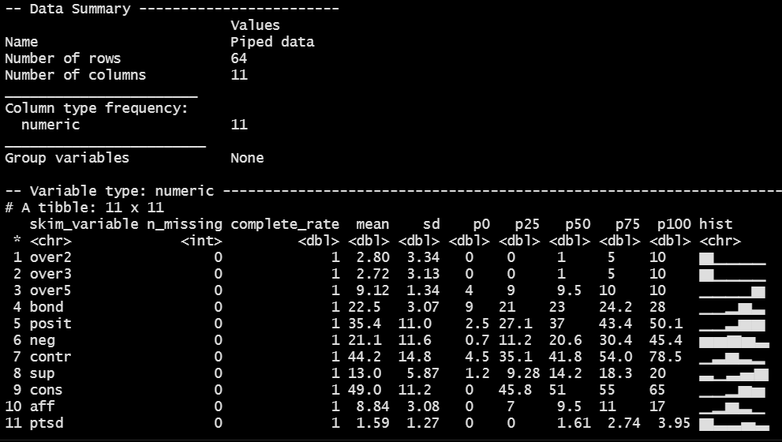
```

## Transformation of Outcome

```{r, echo = FALSE, fig.height = 6}
p1 <- ggplot(maleptsd, aes(x = ptsd_raw)) +
    geom_histogram(bins = 9, fill = "red", col = "white") +
    ylim(c(0, 32)) +
    labs(title = "Original PTSD scores")

p2 <- ggplot(maleptsd, aes(x = ptsd)) +
    geom_histogram(bins = 9, fill = "blue", col = "white") +
    ylim(c(0, 32)) +
    labs(title = "After Transformation")

p1 + p2
```

## Hmisc::describe() for this transformed outcome

```{r, eval = FALSE}
maleptsd %$% describe(ptsd)
```

```{r, echo = FALSE, fig.align = "center", out.width = '90%'}
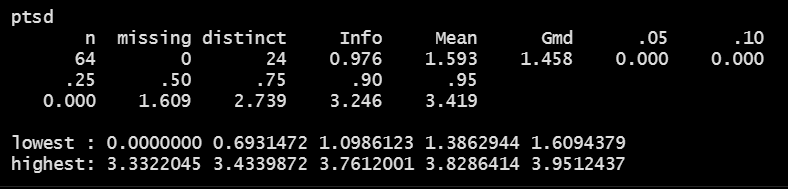
```

- `Gmd` is Gini's mean difference, a robust measure of variation. 
- If you randomly selected two of the 64 subjects, the average difference in `ptsd` would be 1.458.

## Scatterplot Matrix (code)

```{r, eval = FALSE}
temp <- maleptsd %>%
    select(over2, over3, over5, bond, posit, neg, contr, 
           sup, cons, aff, ptsd)

ggpairs(temp)  ## ggpairs from the GGally package
```

- Note that I've placed the outcome (`ptsd`) last here.
- Result is on the next slide...

## Scatterplot Matrix (result)

```{r, echo = FALSE, fig.height = 6}
temp <- maleptsd %>%
    select(over2, over3, over5, bond, posit, neg, contr, 
           sup, cons, aff, ptsd)

ggpairs(temp)  ## ggpairs from the GGally package
```

# Using `ols` to fit a linear regression model

## Fitting using `ols`

The `ols` function stands for ordinary least squares and comes from the `rms` package, by Frank Harrell and colleagues. Any model fit with `lm` can also be fit with `ols`.


To predict `var_y` using `var_x` from the `my_tibble` data, we would use the following syntax:

```{r, eval = FALSE}
dd <- datadist(my_tibble)
options(datadist = "dd")

model_name <- ols(var_y ~ var_x, data = my_tibble,
                  x = TRUE, y = TRUE)
```

This leaves the following questions:

1. What's the `datadist` stuff doing?
2. Why use `x = TRUE, y = TRUE` in the fit?

## What is `datadist`?

Before we fit any `ols` model to data from `my_tibble`, we'll use:

```{r, eval = FALSE}
dd <- datadist(my_tibble)
options(datadist = "dd")
```

> Run (the datadist code above) once before any models are fitted, storing the distribution summaries for all potential variables. Adjustment values are 0 for binary variables, the most frequent category (or optionally the first category level) for categorical (factor) variables, the middle level for ordered factor variables, and medians for continuous variables.

- excerpted from the `datadist` documentation

## Why use `x = TRUE, y = TRUE` in the fit?

Once we've set up the distribution summaries with the `datadist` code, we fit linear regression models using the same fitting routines as `lm` with `ols`:

```{r, eval = FALSE}
model_name <- ols(var_y ~ var_x, data = my_tibble,
                  x = TRUE, y = TRUE)
```

- `ols` stores additional information beyond what `lm` does
- `x = TRUE` and `y = TRUE` save even more expanded information that we'll need in building plots and summaries of the fit. 
- The defaults are `x = FALSE, y = FALSE`, but in this class, we'll always want to include these additional pieces.

## Using `ols` to fit a Two-Predictor Model

Now, we'll fit an `ols` model predicting our outcome (`ptsd`) using two predictors (`over2` and `over3`) using the `maleptsd` tibble.

- Start with setting the `datadist` up
- Then fit the model, including `x = TRUE, y = TRUE`

```{r}
dd <- datadist(maleptsd)
options(datadist = "dd")

mod_first <- ols(ptsd ~ over2 + over3, data = maleptsd,
                 x = TRUE, y = TRUE)
```


## Contents of `mod_first`?

```{r, eval = FALSE}
mod_first
```


```{r, echo = FALSE, fig.align = "center", out.height = '65%'}
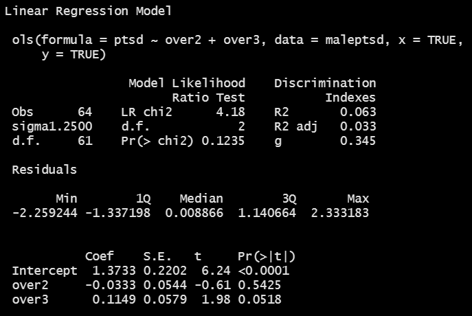
```

- Likelihood Ratio test?
- What is `g`?

## New elements in `ols`

For our `mod_first`,

- Model Likelihood Ratio test output includes `LR chi2 = 4.18, d.f. = 2, Pr(> chi2) = 0.1235`

The log of the likelihood ratio, multiplied by -2, yields a test against a $\chi^2$ distribution. Interpret this as a goodness-of-fit test that compares `mod_first` to a null model with only an intercept term. In `ols` this is similar to a global (ANOVA) F test.

- Under the $R^2$ values, we have `g = 0.345`.
- This is the $g$-index, based on Gini's mean difference. If you randomly selected two of the subjects in the model, the average difference in predicted `ptsd` will be 0.345. 
- This can be compared to the Gini's mean difference for the original `ptsd` values, from `Hmisc::describe`, which was `Gmd = 1.458`.

## Validate the summary statistics of an `ols` fit

- Can we validate summary statistics by resampling? 

```{r, eval = FALSE}
set.seed(432010)
validate(mod_first)
```

```{r, echo = FALSE, fig.align = "center", out.width = '90%'}
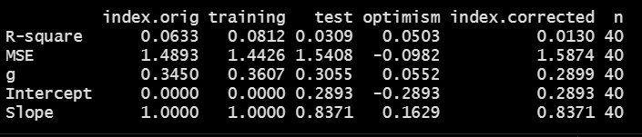
```

- The data used to fit the model provide an over-optimistic view of the quality of fit.
- We're interested here in assessing how well the model might work in new data, and to do so, we can use a resampling approach.
- Consider $R^2$ here...

## Interpreting the Resampling Validation Results

```
    index.orig training   test optimism index.corrected  n
R-sq    0.0633   0.0812 0.0309   0.0503          0.0130 40
```

- `index.orig` for $R^2$ is 0.0633. That's what we get from the data we used to fit the model, and is what we see in our standard output.
- With `validate` we create 40 (by default) bootstrapped resamples of the data and then split each of those into training and test samples.
    - For each of the 40 splits, R refits the model (same predictors) in the `training` sample to obtain $R^2$: mean across 40 splits is 0.0812.
    - Check each model in its `test` sample: average $R^2$ was 0.0309.
- `optimism` = `training` result - `test` result = 0.0503
- `index.corrected` = `index.orig` - `optimism` = 0.0130

While our *nominal* $R^2$ is 0.0633 for this model, but correcting for optimism yields a *validated* $R^2$ of 0.0130.

- $R^2 = 0.0130$ better estimates how the model will perform in new data.

## ANOVA for `mod_first` fit by `ols`

```{r, eval = FALSE}
anova(mod_first)
```

```{r, echo = FALSE, fig.align = "center", out.width = '90%'}
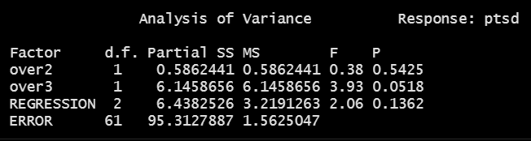
```

- This adds a line for the complete regression model (both terms) which can be helpful, but is otherwise the same as `anova` after `lm`.
- As with `lm`, this is a sequential ANOVA table, so if we had included over3 in the model first, we'd get a different SS, MS, F and p for `over2` and `over3`, but the same `REGRESSION` and `ERROR` results.

## summary for `mod_first` fit by `ols`

```{r, eval = FALSE}
summary(mod_first)
```

```{r, echo = FALSE, fig.align = "center", out.width = '90%'}
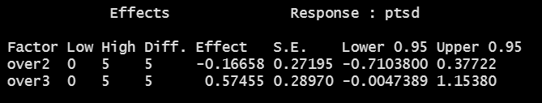
```

- For `over2` effect `-0.16658` is the estimated change in `ptsd` associated with a move from `over2` = 0 (see `Low` value) to `over2` = 5 (the `High` value) assuming no change in `over3`.
- `ols` chooses the `Low` and `High` values from the interquartile range.

```{r}
maleptsd %$% quantile(over2, c(0.25, 0.75))
```

## Plot the summary to see effect sizes

- Goal: plot effect sizes for similar moves within predictor distributions.

```{r, fig.height = 3}
plot(summary(mod_first))
```

- The triangles indicate the point estimate, augmented with confidence interval bars.
    - The 90% confidence intervals are plotted with the thickest bars.
    - The 95% CIs are then shown with thinner, more transparent bars.
    - Finally, the 99% CIs are shown as the longest, thinnest bars.

## What do the individual effects look like?

```{r, fig.height = 3.5}
ggplot(Predict(mod_first, conf.int = 0.95), layout = c(1,2))
```

- The left plot shows the impact of changing `over2` on `ptsd` holding `over3` constant at the median `over3` value, which is `r median(maleptsd$over3)`.
- The right plot shows the impact of changing `over3` on `ptsd` holding `over2` constant at its median value, which is `r median(maleptsd$over2)`.
- Defaults: add 95% CI bands and layout tries for a square.

## Build a nomogram for the `ols` fit

```{r, fig.height = 6}
plot(nomogram(mod_first))
```

## Nomograms

For complex models (this model isn't actually very complex) it can be helpful to have a tool that will help you see the effects of model in terms of their impact on the predicted outcome.

A *nomogram* is an established graphical tool for doing this.

- Find the value of each predictor on its provided line, and identify the "points" for that predictor by drawing a vertical line up to the "Points".
- Then sum up the points over all predictors to obtain "Total Points".
- Draw a vertical line down from the "Total Points" to the "Linear Predictor" to get the predicted `ptsd` for this subject.

## Using the nomogram for the `ols` fit

Predicted `ptsd` for a subject with `over2` = 8 and `over3` = 7?

```{r, echo = FALSE, fig.height = 6}
plot(nomogram(mod_first))
```

## Actual Prediction for such a subject...

- The `predict` function for an `ols` fit can provide fitted values.

```{r}
predict(mod_first, 
           newdata = tibble(over2 = 8, over3 = 7))
```

- The `broom` package doesn't (really) support `rms` fits, and throws a warning (omitted here), but you could always refit the model with `lm`...

```{r, warning = FALSE}
augment(mod_first, 
           newdata = tibble(over2 = 8, over3 = 7))
```

## Assessing the Calibration of `mod_first`

We would like our model to be well-calibrated, in the following sense...

- Suppose our model assigns a predicted outcome of 6 to several subjects. If the model is well-calibrated, then we expect the mean of those subjects' actual outcomes to be very close to 6.

We'd like to look at the relationship between the observed `ptsd` outcome and our predicted `ptsd` from the model.

- The calibration plot we'll create provides two estimates (with and without bias-correction) of the predicted vs. observed values of our outcome, and compares these to the ideal scenario (predicted = observed).
- The plot uses resampling validation to produce bias-corrected estimates and uses lowess smooths to connect across predicted values.
- Calibration plots require `x = TRUE, y = TRUE` in the `ols` fit.

## Calibration Plot for `mod_first`

```{r, fig.height = 5}
set.seed(432); plot(calibrate(mod_first))
```

## Influential Points for `mod_first`?

The `dfbeta` value for a particular subject and coefficient $\beta$ is the change in the coefficient that happens when the subject is excluded from the model.

```{r}
which.influence(mod_first, cutoff = 0.3)
```

- These are the subjects that have absolute values of `dfbetas` that exceed the specified cutoff (default is 0.2)


## Show the influential points more directly?

```{r}
w <- which.influence(mod_first, cutoff = 0.3)
d <- maleptsd %>% select(over2,over3,ptsd) %>% data.frame()
show.influence(w, d)
```

- Count = number of coefficients where this row appears influential.
- Use `maleptsd %>% slice(32)` to see row 32 in its entirety.
- Use residual plots (with an `lm` fit) to check Cook's distances.

## Fitting Residual Plots for this model

To fit residual plots (and sometimes to do other things) we will fit the `lm` version of this same model...

```{r, eval = FALSE}
mod_first_lm <- lm(ptsd ~ over2 + over3, data = maleptsd)

par(mfrow = c(2,2))
plot(mod_first_lm)
par(mfrow = c(1,1))
```

- Plots are shown on the next slide. While the subject in row 32 is more influential than most other points, it doesn't reach the standard of a problematic Cook's distance.

## Residual Plots for `mod_first`

```{r, echo = FALSE, fig.height = 6}
mod_first_lm <- lm(ptsd ~ over2 + over3, data = maleptsd)

par(mfrow = c(2,2))
plot(mod_first_lm)
par(mfrow = c(1,1))
```

# Thinking about Non-Linear Terms?

## Non-Linear Terms

In building a linear regression model, we're most often going to be thinking about:

- for quantitative predictors, some curvature...
    - perhaps polynomial terms 
    - but more often restricted cubic splines
- for any predictors, possible interactions
    - between categorical predictors 
    - between categorical and quantitative predictors
    - between quantitative predictors

## Polynomial Regression

A polynomial in the variable `x` of degree D is a linear combination of the powers of `x` up to D. Fitting such a model creates a **polynomial regression**.

- Linear: $y = \beta_0 + \beta_1 x$
- Quadratic: $y = \beta_0 + \beta_1 x + \beta_2 x^2$
- Cubic: $y = \beta_0 + \beta_1 x + \beta_2 x^2 + \beta_3 x^3$
- Quartic: $y = \beta_0 + \beta_1 x + \beta_2 x^2 + \beta_3 x^3 + \beta_4 x^4$
- Quintic: $y = \beta_0 + \beta_1 x + \beta_2 x^2 + \beta_3 x^3 + \beta_4 x^4 + \beta_5 x^5$

An **orthogonal polynomial** sets up a model design matrix and then scales those columns so that each column is uncorrelated with the previous ones. 

- This reduction in collinearity (correlation between predictors) lets us gauge whether the addition of any particular polynomial term improves model fit.

## Using `over3` to predict `ptsd`

- Let's look at both a linear fit and a loess smooth to see if they indicate meaningfully different things about the association.

```{r, eval = FALSE}
ggplot(maleptsd, aes(x = over3, y = ptsd)) + 
    geom_point(size = 2) +
    geom_smooth(method = "loess", formula = y ~ x, 
                se = FALSE, col = "blue") +
    geom_smooth(method = "lm", formula = y ~ x,
                se = FALSE, col = "red") + 
    labs(title = "Linear and Loess Fits for ptsd vs. over3")
```

## Linear and Loess Fits for `ptsd` with `over3`

```{r, echo = FALSE, fig.height = 6}
ggplot(maleptsd, aes(x = over3, y = ptsd)) + 
    geom_point(size = 2) +
    geom_smooth(method = "loess", formula = y ~ x, 
                se = FALSE, col = "blue") +
    geom_smooth(method = "lm", formula = y ~ x,
                se = FALSE, col = "red") + 
    labs(title = "Linear and Loess Fits for ptsd vs. over3")
```

## Fitting polynomial regressions with `ols`

```{r}
dd <- datadist(maleptsd)
options(datadist = "dd")

mod_B1 <- ols(ptsd ~ over3, 
              data = maleptsd, x = TRUE, y = TRUE)
mod_B2 <- ols(ptsd ~ pol(over3, 2), 
              data = maleptsd, x = TRUE, y = TRUE)
mod_B3 <- ols(ptsd ~ pol(over3, 3),
              data = maleptsd, x = TRUE, y = TRUE)
```

- Note the use of `pol()` from the `rms` package here to fit orthogonal polynomials, rather than `poly()` which we used for an `lm` fit.

## Model B1 (linear in `over3`)

```{r, eval = FALSE}
mod_B1
```

```{r, echo = FALSE, fig.align = "center", out.height = '65%'}
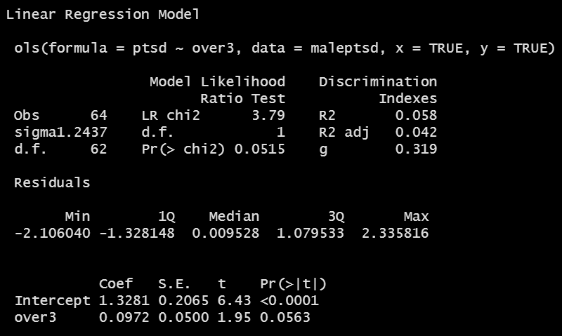
```

## Model B2 (quadratic polynomial in `over3`)

```{r, eval = FALSE}
mod_B2
```

```{r, echo = FALSE, fig.align = "center", out.height = '65%'}
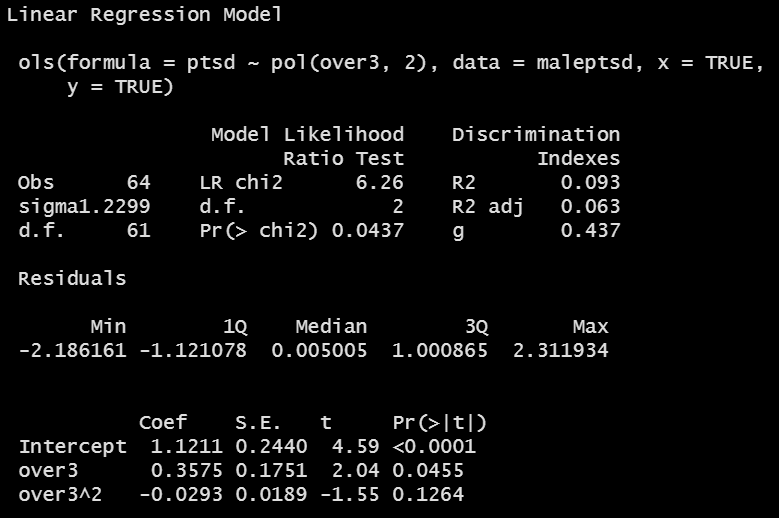
```

## Model B3 (cubic polynomial in `over3`)

```{r, eval = FALSE}
mod_B3
```

```{r, echo = FALSE, fig.align = "center", out.height = '65%'}
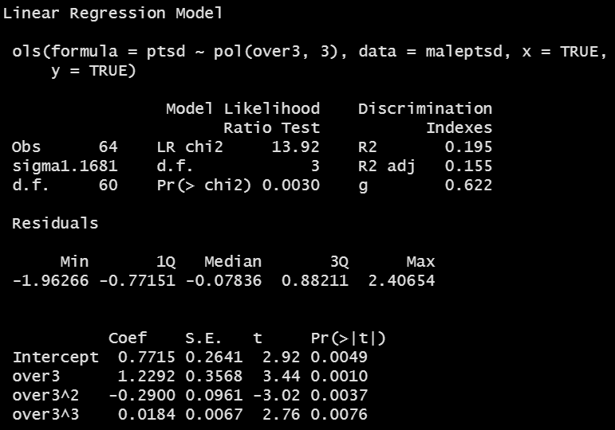
```

## Store the polynomial fits

First, we need to store the values. Again `broom` doesn't play well with `ols` fits, so I'll just add the predictions as columns

```{r}
ptsd_fits <- maleptsd %>%
    mutate(fitB1 = predict(mod_B1),
           fitB2 = predict(mod_B2),
           fitB3 = predict(mod_B3))
```

## Code to plot polynomial fits

```{r, eval = FALSE, fig.height = 6}
ggplot(ptsd_fits, aes(x = over3, y = ptsd)) +
    geom_point() +
    geom_line(aes(x = over3, y = fitB1),
              col = "blue", size = 1.25) +
    geom_line(aes(x = over3, y = fitB2),
              col = "black", size = 1.25) +
    geom_line(aes(x = over3, y = fitB3),
              col = "red", size = 1.25) +
    geom_text(x = 2.5, y = 1.3, label = "Linear Fit", 
              size = 5, col = "blue") +
    geom_text(x = 7, y = 2.5, label = "Quadratic Fit", 
              size = 5, col = "black") +
    geom_text(x = 3, y = 2.6, label = "Cubic Fit", 
              size = 5, col = "red") +
    labs(title = "Linear, Quadratic and Cubic Fits for ptsd using over3") 
```
## The Polynomial Fits, plotted

```{r, echo = FALSE, fig.height = 6}
ggplot(ptsd_fits, aes(x = over3, y = ptsd)) +
    geom_point() +
    geom_line(aes(x = over3, y = fitB1),
              col = "blue", size = 1.25) +
    geom_line(aes(x = over3, y = fitB2),
              col = "black", size = 1.25) +
    geom_line(aes(x = over3, y = fitB3),
              col = "red", size = 1.25) +
    geom_text(x = 2.5, y = 1.3, label = "Linear Fit", 
              size = 5, col = "blue") +
    geom_text(x = 7, y = 2.5, label = "Quadratic Fit", 
              size = 5, col = "black") +
    geom_text(x = 3, y = 2.6, label = "Cubic Fit", 
              size = 5, col = "red") +
    labs(title = "Linear, Quadratic and Cubic Fits for ptsd using over3") 
```

## Code to plot polynomial fits with Predict

```{r, eval = FALSE, fig.height = 6}
p1 <- ggplot(Predict(mod_B1)) + ggtitle("B1: Linear")
p2 <- ggplot(Predict(mod_B2)) + ggtitle("B2: Quadratic")
p3 <- ggplot(Predict(mod_B3)) + ggtitle("B3. Cubic")

p1 + p2 + p3
```

## Visualizing the polynomial fits with Predict

```{r, echo = FALSE, fig.height = 6}
p1 <- ggplot(Predict(mod_B1)) + ggtitle("B1: Linear")
p2 <- ggplot(Predict(mod_B2)) + ggtitle("B2: Quadratic")
p3 <- ggplot(Predict(mod_B3)) + ggtitle("B3. Cubic")

p1 + p2 + p3
```

## Splines

- A **linear spline** is a continuous function formed by connecting points (called **knots** of the spline) by line segments.
- A **restricted cubic spline** is a way to build highly complicated curves into a regression equation in a fairly easily structured way.
- A restricted cubic spline is a series of polynomial functions joined together at the knots. 
    + Such a spline gives us a way to flexibly account for non-linearity without over-fitting the model.
    + Restricted cubic splines can fit many different types of non-linearities.
    + Specifying the number of knots is all you need to do in R to get a reasonable result from a restricted cubic spline. 

The most common choices are 3, 4, or 5 knots. 

- 3 Knots, 2 degrees of freedom, allows the curve to "bend" once.
- 4 Knots, 3 degrees of freedom, lets the curve "bend" twice.
- 5 Knots, 4 degrees of freedom, lets the curve "bend" three times. 

## Fitting Restricted Cubic Splines with `ols`

Let's consider a restricted cubic spline model for `ptsd` based on `over3` with:

- 3 knots in `modC3`, 4 knots in `modC4`, and 5 knots in `modC5`

```{r}
dd <- datadist(maleptsd)
options(datadist = "dd")

mod_C3 <- ols(ptsd ~ rcs(over3, 3), 
              data = maleptsd, x = TRUE, y = TRUE)
mod_C4 <- ols(ptsd ~ rcs(over3, 4), 
              data = maleptsd, x = TRUE, y = TRUE)
mod_C5 <- ols(ptsd ~ rcs(over3, 5),
              data = maleptsd, x = TRUE, y = TRUE)
```

## Model C3 (3-knot spline in `over3`)

```{r, eval = FALSE}
mod_C3
```

```{r, echo = FALSE, fig.align = "center", out.height = '65%'}
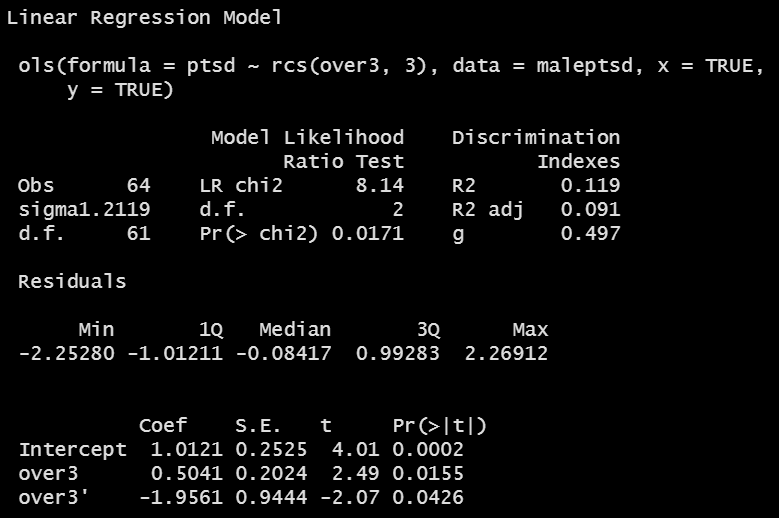
```

## Model C4 (4-knot spline in `over3`)

```{r, eval = FALSE}
mod_C4
```

```{r, echo = FALSE, fig.align = "center", out.height = '65%'}
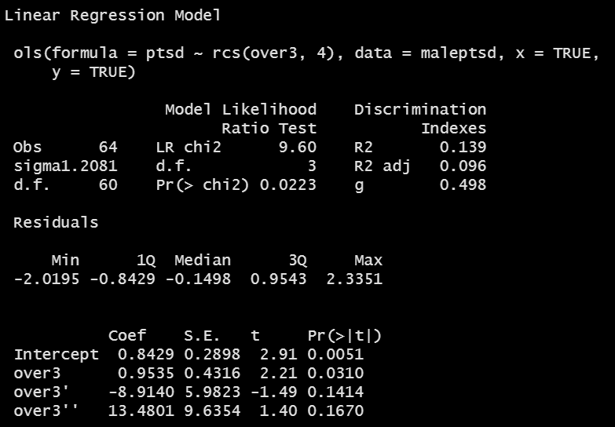
```

## Model C5 (5-knot spline in `over3`)

```{r, eval = FALSE}
mod_C5
```

```{r, echo = FALSE, fig.align = "center", out.height = '65%'}
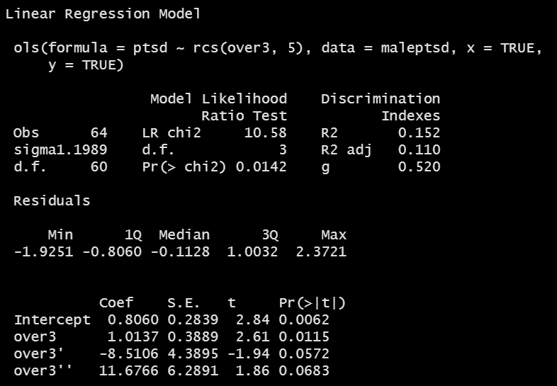
```

## Code to plot all six fits

```{r, eval = FALSE, fig.height = 6}
p1 <- ggplot(Predict(mod_B1)) + ggtitle("B1: Linear")
p2 <- ggplot(Predict(mod_B2)) + ggtitle("B2: Quadratic")
p3 <- ggplot(Predict(mod_B3)) + ggtitle("B3. Cubic")
p4 <- ggplot(Predict(mod_C3)) + ggtitle("C3: 3-knot RCS")
p5 <- ggplot(Predict(mod_C4)) + ggtitle("C4. 4-knot RCS")
p6 <- ggplot(Predict(mod_C5)) + ggtitle("C5. 5-knot RCS")

(p1 + p2 + p3) / (p4 + p5 + p6)
```

## Visualizing the fits better?

```{r, echo = FALSE, fig.height = 6}
p1 <- ggplot(Predict(mod_B1)) + ggtitle("B1: Linear")
p2 <- ggplot(Predict(mod_B2)) + ggtitle("B2: Quadratic")
p3 <- ggplot(Predict(mod_B3)) + ggtitle("B3. Cubic")
p4 <- ggplot(Predict(mod_C3)) + ggtitle("C3: 3-knot RCS")
p5 <- ggplot(Predict(mod_C4)) + ggtitle("C4. 4-knot RCS")
p6 <- ggplot(Predict(mod_C5)) + ggtitle("C5. 5-knot RCS")

(p1 + p2 + p3) / (p4 + p5 + p6)
```

# Data Spending: Non-Linearity Prior to Fits

## Spending degrees of freedom wisely

- Suppose we have a data set with many possible predictors, and minimal theory or subject matter knowledge to guide us.
- We might want our final inferences to be as unbiased as possible. To accomplish this, we have to pay a penalty (in terms of degrees of freedom) for any "peeks" we make at the data in advance of fitting a model.
- So that rules out a lot of decision-making about non-linearity based on looking at the data, if our sample size isn't much larger than 15 times the number of predictors we're considering including in our model.
- In our case, we have n = 64 observations on 10 predictors. 
- In addition, adding non-linearity to our model costs additional degrees of freedom.
- What can we do?

## Spearman's $\rho^2$ plot: A smart first step?

Spearman's $\rho^2$ is an indicator (not a perfect one) of potential predictive punch, but doesn't give away the game.

- Idea: Perhaps we should focus our efforts re: non-linearity on predictors that score better on this measure.

```{r}
spear_ptsd <- spearman2(ptsd ~ over2 + over3 + over5 + bond +
                   posit + neg + contr + sup + cons + aff, 
               data = maleptsd)
```

## Spearman's $\rho^2$ Plot

```{r, fig.height = 5}
plot(spear_ptsd)
```

## Conclusions from Spearman $\rho^2$ Plot

- `neg` is the most attractive candidate for a non-linear term, as it packs the most potential predictive punch, so if it does turn out to need non-linear terms, our degrees of freedom will be well spent. 
    + By no means is this suggesting that `neg` actually needs a non-linear term, or will show significant non-linearity. We'd have to fit a model with and without non-linearity in `neg` to know that.
    + Non-linearity will often take the form of a product term, a polynomial term, or a restricted cubic spline.
    + Since all of these predictors are quantitative, we'll think about polynomial or spline terms, soon.
- `over3`, also quantitative, has the next most potential predictive punch
- these are followed by `cons` and `aff`

## Grim Reality

With 64 observations (63 df) we should be thinking about models with relatively tiny numbers of regression inputs. 

- Non-linear terms (polynomials, splines) just add to the problem, as they need additional df to be estimated.

In this case, we might choose between 

- including non-linearity in one (or maybe 2) variables (and that's it),
- or a linear model including maybe 3-4 predictors, tops

and even that would be tough to justify with this small sample size.

## Contents of `spear_ptsd`

```{r}
spear_ptsd
```

## Proposed New Model

Fit a model to predict `ptsd` using:

- a 4-knot spline on `neg`
- a 3-knot spline on `over3`
- a linear term on `cons`
- a linear term on `aff`

Perhaps more than we can reasonably do with 64 observations, but let's see how it looks.

```{r}
dd <- datadist(maleptsd)
options(datadist = "dd")

mod_second <- ols(ptsd ~ rcs(neg, 4) + rcs(over3, 3) +
                 cons + aff, data = maleptsd,
                 x = TRUE, y = TRUE)
```

## Our second model

```{r, eval = FALSE}
mod_second
```

```{r, echo = FALSE, fig.align = "center", out.height = '80%'}
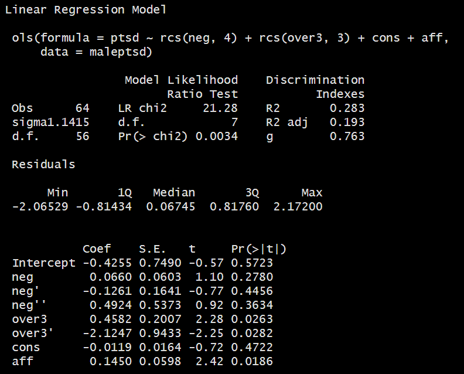
```

## ANOVA for this model

```{r}
anova(mod_second)
```

- Remember that this ANOVA testing is sequential.

## Validation of Summary Statistics

```{r, eval = FALSE}
set.seed(432); validate(mod_second)
```

```{r, echo = FALSE, fig.align = "center", out.width = '80%'}
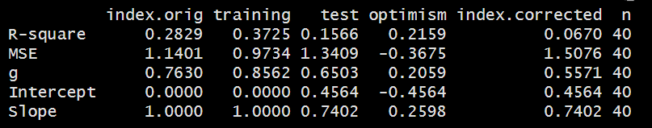
```

## `summary` results for `mod_second`

```{r, eval = FALSE}
summary(mod_second)
```

```{r, echo = FALSE, fig.align = "center", out.width = '80%'}
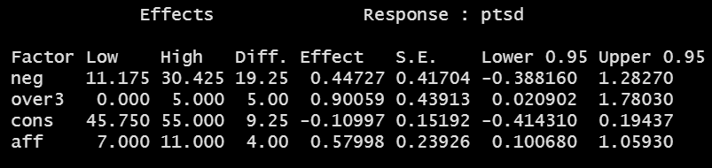
```

## Plot of `summary` results for `mod_second`

```{r, fig.height = 6}
plot(summary(mod_second))
```

## Nomogram for `mod_second`

```{r, fig.height = 6}
plot(nomogram(mod_second))
```

## Seeing the impact of the modeling another way

```{r, fig.height = 5}
ggplot(Predict(mod_second))
```

## Checking the model's calibration

```{r, fig.height = 5}
set.seed(432); plot(calibrate(mod_second))
```

## Limitations of `lm` for fitting complex linear models

We can certainly assess this big, complex model using `lm`, too:

- with in-sample summary statistics like adjusted R^2^, AIC and BIC,
- we can assess its assumptions with residual plots, and 
- we can also compare out-of-sample predictive quality through cross-validation,

But to really delve into the details of how well this complex model works, and to help plot what is actually being fit, we'll probably want to fit the model using `ols`. 

- In Project 1, we expect some results that are most easily obtained using `lm` and others that are most easily obtained using `ols`.

## Next Time

- The HERS data
- Fitting a more complex linear regression model
    - Dealing with categorical predictors
    - Dealing with interactions (another form of non-linearity)
    - Adding missing data into all of this, and running multiple imputation
    
**Don't forget** to complete the Minute Paper after Class 7 by tomorrow at Noon!
