```{r set-options, echo=FALSE, cache=FALSE}
knitr::opts_chunk$set(comment=NA)
options(width = 60)
```

## Setup

```{r, warning = FALSE, message = FALSE}
library(magrittr); library(janitor)
library(here); library(knitr)
library(naniar); library(simputation)

library(rms)
library(tidyverse)
```

## Today's Data

Heart and Estrogen/Progestin Study (HERS)

- Clinical trial of hormone therapy for the prevention of recurrent heart attacks and deaths among 2763 post-menopausal women with existing coronary heart disease (see Hulley et al 1998 and many subsequent references, including Vittinghoff, Chapter 4.)
- We're excluding the women in the trial with a diabetes diagnosis.

```{r, message = FALSE}
hers_raw <- read_csv(here("data/hersdata.csv")) %>% 
    clean_names()

hers1 <- hers_raw %>%
    filter(diabetes == "no") %>%
    select(subject, ldl, ht, age, smoking, drinkany, sbp,
           physact, bmi, diabetes)
```


## The Codebook (n = `r nrow(hers1)`)

Variable   | Description 
---------: | --------------------------------- 
`subject`  | subject code 
`HT`       | factor: hormone therapy or placebo 
`diabetes` | yes or no (all are no in our sample)
`ldl`      | LDL cholesterol in mg/dl 
`age`      | age in years 
`smoking`  | yes or no
`drinkany` | yes or no
`sbp`      | systolic BP in mm Hg
`physact`  | 5-level factor, details next slide
`bmi`      | body-mass index in kg/m^2^

**Goal** Predict `ldl` using `age`, `smoking`, `drinkany`, `sbp`, `physact` and `bmi`, across both HT levels but restricted to women without `diabetes`.

## The `physact` variable

```{r}
hers1 %>% count(physact)
```

Comparison is to activity levels for these women just before menopause.

## Any missing data?

```{r}
miss_var_summary(hers1)
```

## Single Imputation for `drinkany`, `bmi` and `ldl`

Since `drinkany` is a factor, we have to do some extra work to impute.

```{r}
set.seed(432092)

hers2 <- hers1 %>%
    mutate(drinkany_n = 
               ifelse(drinkany == "yes", 1, 0)) %>%
    impute_pmm(drinkany_n ~ age + smoking) %>%
    mutate(drinkany = 
               ifelse(drinkany_n == 1, "yes", "no")) %>%
    impute_rlm(bmi ~ age + smoking + sbp) %>%
    impute_rlm(ldl ~ age + smoking + sbp + bmi) 
```

## Now, check missingness...

```{r}
miss_var_summary(hers2)
```

## Multiple Imputation using `aregImpute` from `Hmisc`

Model to predict all missing values of any variables, using additive regression bootstrapping and predictive mean matching.

Steps are:

1. `aregImpute` draws a sample with replacement from the observations where the target variable is observed, not missing. 
2. It then fits a flexible additive model to predict this target variable while finding the optimum transformation of it. 
3. It then uses this fitted flexible model to predict the target variable in all of the original observations.
4. Finally, it imputes each missing value of the target variable with the observed value whose predicted transformed value is closest to the predicted transformed value of the missing value.

## Fitting a Multiple Imputation Model

```{r}
set.seed(4320132)
dd <- datadist(hers1)
options(datadist = "dd")
fit3 <- aregImpute(~ ldl + age + smoking + drinkany +
                       sbp + physact + bmi, 
                   nk = c(0, 3:5), tlinear = FALSE,
                   data = hers1, B = 10, n.impute = 20) 
```


## Multiple Imputation using `aregImpute` from `Hmisc`

`aregImpute` requires specifications of all variables, and several other details:

- `n.impute` = number of imputations, we'll run 20
- `nk` = number of knots to describe level of complexity, with our choice `nk = c(0, 3:5)` we'll fit both linear models and models with restricted cubic splines with 3, 4, and 5 knots
- `tlinear = FALSE` allows the target variable to have a non-linear transformation when `nk` is 3 or more
- `B = 10` specifies 10 bootstrap samples will be used
- `data` specifies the source of the variables


## `aregImpute` Imputation Results (1 of 4)

```{r, eval = FALSE}
fit3
```

```
Multiple Imputation using Bootstrap and PMM

aregImpute(formula = ~ldl + age + smoking + drinkany + sbp + 
 physact + bmi, data = hers1, n.impute = 20, nk = c(0, 3:5), 
 tlinear = FALSE, B = 10)

n: 2032 	p: 7 	Imputations: 20  	nk: 0 

Number of NAs:
 ldl  age  smoking drinkany  sbp  physact    bmi 
   7    0        0        2    0        0      2
```
## `fit3` Imputation Results (2 of 4)

```
R-squares for Predicting Non-Missing Values for Each 
Variable Using Last Imputations of Predictors
     ldl drinkany      bmi 
   0.041    0.014    0.109 
```

## `fit3` Imputation Results (3 of 4)

Resampling results for determining the complexity of imputation models

Variable being imputed: ldl

Bootstrap bias-corrected summaries:

Statistic | nk = 0 | nk = 3 | nk = 4 | nk = 5
-----------------: | -----: | -----: | -----: | -----: 
R^2 | 0.0139 |  0.0149  | 0.00776  | 0.0124
mean absolute error | 28.3594 | 42.9139 |  44.09937 | 39.8266
median abs. error | 22.8301 | 35.5441 | 38.85302 | 32.6386

10-fold cross-validated:

Statistic | nk = 0 | nk = 3 | nk = 4 | nk = 5
-----------------: | -----: | -----: | -----: | -----: 
R^2 | 0.0214 |  0.0180  | 0.01517  | 0.0191
mean absolute error | 145.7176 | 43.5007 | 45.02428 | 44.2456
median abs. error | 141.4238 | 36.4102 |  38.88053 | 37.3141


## `fit3` Imputation Results (4 of 4)

```
Variable being imputed: drinkany 
                            nk=0   nk=3   nk=4    nk=5
Bootstrap  R^2            0.0163 0.0113 0.0102 0.00986
10-fold cv R^2            0.0205 0.0249 0.0163 0.01358
Bootstrap  mean |error|   0.4470 0.4568 0.4558 0.46624
10-fold cv mean |error|   0.4450 0.4454 0.4476 0.44676
Bootstrap median |error|  0.0000 0.0000 0.0000 0.00000
10-fold cv median |error| 0.0000 0.0500 0.1000 0.00000

Variable being imputed: bmi 
                             nk=0   nk=3   nk=4   nk=5
Bootstrap  R^2             0.0845 0.0932 0.0946 0.0847
10-fold cv R^2             0.0864 0.0903 0.0968 0.0899
Bootstrap  mean |error|    3.7829 4.8119 4.9226 5.1775
10-fold cv mean |error|   27.6776 4.8359 4.9390 5.1136
Bootstrap median |error|   2.9955 3.9704 3.9371 4.2634
10-fold cv median |error| 27.0143 3.9894 3.9431 4.1876
```

## A plot of the imputed values... (results)

```{r, echo = FALSE, fig.height = 6}
par(mfrow = c(1,3))
plot(fit3)
par(mfrow = c(1,1))
```


## A plot of the imputed values... (code)

```{r, eval = FALSE}
par(mfrow = c(1,3))
plot(fit3)
par(mfrow = c(1,1))
```

- For `ldl`, we imputed most of the 7 missing subjects in most of the 20 imputation runs to values within a range of around 120 through 200, but occasionally, we imputed values that were substantially lower than 100. 
- For `drinkany` we imputed about 70% no and 30% yes.
- For `bmi`, we imputed values ranging from about 23 to 27 in many cases, and up near 40 in other cases. 
- This method never imputes a value for a variable that doesn't already exist in the data.

## Kitchen Sink Model (Main Effects only)

```{r}
mod_ks <- ols(ldl ~ age + smoking + drinkany + sbp + 
                physact + bmi, data = hers2)
anova(mod_ks)
```

## Spearman $\rho^2$ Plot

How should we prioritize the degrees of freedom we spend on non-linearity?

```{r, eval = F}
plot(spearman2(ldl ~ age + smoking + drinkany + sbp + 
                   physact + bmi, data = hers2))
```

Plot's on the next page.

- Note the use of the simple imputation `hers2` data here. Why?

## Spearman $\rho^2$ Plot Result

```{r, echo = F}
plot(spearman2(ldl ~ age + smoking + drinkany + sbp + 
                   physact + bmi, data = hers2))
```

## Spending Degrees of Freedom

We're spending 9 degrees of freedom in our kitchen sink model. (We can verify this with `anova` or the plot.)

- Each quantitative main effect costs 1 df to estimate
- Each binary categorical variable also costs 1 df
- Multi-categorical variables with L levels cost L-1 df to estimate

Suppose we're willing to spend up to a total of **14** degrees of freedom (i.e. a combined 5 more on interaction terms and other ways to capture non-linearity.)

What should we choose?

## What did we see in the Spearman $\rho^2$ Plot?

Group 1 (largest adjusted $\rho^2$)

- `bmi`, a quantitative predictor, is furthest to the right

Group 2 (next largest)

- `smoking`, a binary predictor, is next, followed closely by 
- `age`, a quantitative predictor

Other predictors (rest of the group)

- `sbp`, quantitative
- `drinkany`, binary
- `physact`, multi-categorical (5 levels)

## Impact of Adding Non-Linear Terms on Spent DF

What happens when we add a non-linear term?

- Adding a polynomial of degree D costs D degrees of freedom.
  - So a polynomial of degree 2 (quadratic) costs 2 df, or 1 more than the main effect alone.
- Adding a restricted cubic spline with K knots costs K-1 df.
  - So adding a rcs with 4 knots uses 3 df, or 2 more than the main effect.
  - We restrict ourselves to considering splines with 3, 4, or 5 knots.
- Adding an interaction (product term) depends on the main effects of the predictors we are interacting
  - If the product term's predictors have df1 and df2 degrees of freedom, product term adds df1 $\times$ df2 degrees of freedom.
  - An interaction of a binary and quantitative variable adds 1 $\times$ 1 = 1 additional degree of freedom to the main effects model.
  - When we use a quantitative variable in a spline and interaction, we'll do the interaction on the main effect, not the spline.

## Model we'll fit with `ols`

Fitting a model to predict `ldl` using

- `bmi` with a restricted cubic spline, 5 knots
- `age` with a quadratic polynomial
- `sbp` as a linear term
- `drinkany` indicator
- `physact` factor
- `smoking` indicator and its interaction with the main effect of `bmi`

We can fit this to the data

- restricted to complete cases (hers1, effectively)
- after simple imputation (hers2)
- after our multiple imputation (fit3)

# Using only the Complete Cases

## Fitting the model to the complete cases

```{r}
d <- datadist(hers1)
options(datadist = "d")

m1 <- ols(ldl ~ rcs(bmi, 5) + pol(age, 2) + sbp + 
              drinkany + physact + smoking + 
              smoking %ia% bmi, data = hers1,
          x = TRUE, y = TRUE)
```

where `%ia%` identifies the linear interaction alone.

## `m1` results (screen 1/2)

```{r, eval = FALSE}
m1
```

```{r, echo = FALSE, fig.align = "center", out.height = '70%'}
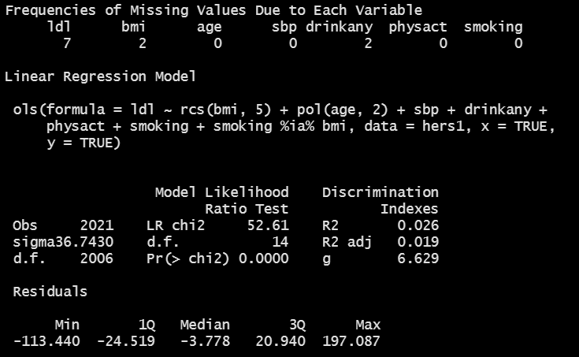
```

## `m1` results (screen 2/2)

```{r, eval = FALSE}
m1
```

```{r, echo = FALSE, fig.align = "center", out.height = '70%'}
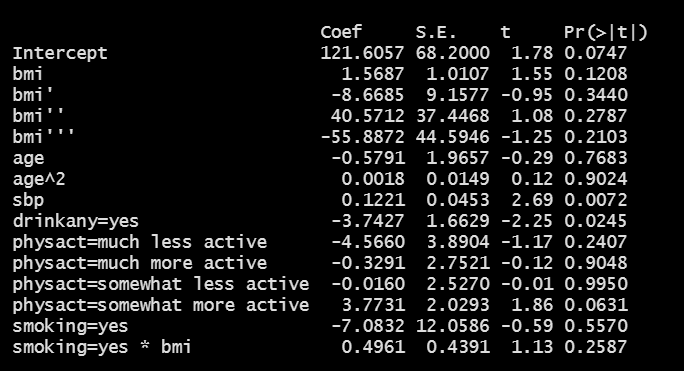
```

# Fit Model after Single Imputation

## Fitting the model after simple imputation

```{r}
dd <- datadist(hers2)
options(datadist = "dd")

m2 <- ols(ldl ~ rcs(bmi, 5) + pol(age, 2) + sbp + 
              drinkany + physact + smoking + 
              smoking %ia% bmi, data = hers2,
          x = TRUE, y = TRUE)
```

where, again, `%ia%` identifies the linear interaction alone.

## `m2` results (screen 1/2)

```{r, eval = FALSE}
m2
```

```{r, echo = FALSE, fig.align = "center", out.width = '90%'}
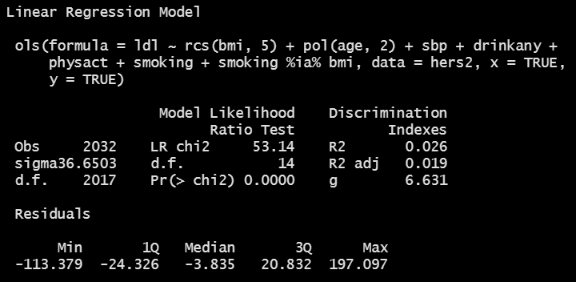
```


## `m2` results (screen 2/2)

```{r, eval = FALSE}
m2
```

```{r, echo = FALSE, fig.align = "center", out.height = '70%'}
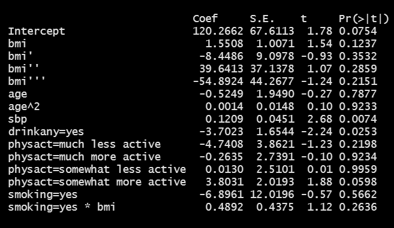
```

## ANOVA results for `m2` from `ols`

```{r, eval = FALSE}
anova(m2)
```

```{r, echo = FALSE, fig.align = "center", out.width = '90%'}
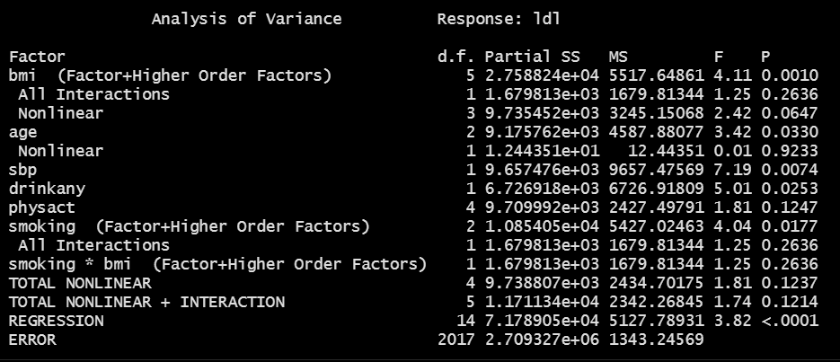
```

## Validation of summary statistics

```{r}
set.seed(432); validate(m2)
```

```{r, echo = FALSE, fig.align = "center", out.width = '90%'}
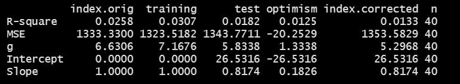
```

## `summary(m2)` results

```{r, eval = FALSE}
summary(m2)
```

```{r, echo = FALSE, fig.align = "center", out.width = '95%'}
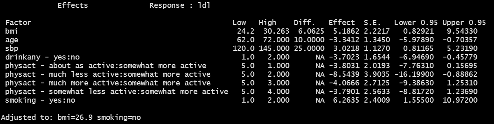
```

- Of course, these should really be plotted...

## Effect Size Plot for `m2`

```{r, fig.height = 5.5}
plot(summary(m2))
```

## Nomogram for `m2`

```{r, echo = FALSE}
plot(nomogram(m2))
```

## Making Predictions for an Individual

Suppose now that we want to use R to get a prediction for a new individual subject with `bmi` = 30, `age` = 50, `smoking` = yes and `physact` = about as active, `drinkany`= yes and `sbp` of 150.

```{r, eval = FALSE}
predict(m2, expand.grid(bmi = 30, age = 50, smoking = "yes",
                        physact = "about as active", 
                        drinkany = "yes", sbp = 150),
        conf.int = 0.95, conf.type = "individual")
```

```
$linear.predictors        $lower     $upper
          160.9399      88.48615   233.3936
```

## Making Predictions for a Long-Run Mean

The other kind of prediction we might wish to make is for the mean of a series of subjects whose `bmi` = 30, `age` = 50, `smoking` = yes and `physact` = about as active, `drinkany`= yes and `sbp` of 150.

```{r, eval = FALSE}
predict(m2, expand.grid(bmi = 30, age = 50, smoking = "yes",
                        physact = "about as active", 
                        drinkany = "yes", sbp = 150),
        conf.int = 0.95, conf.type = "mean")
```

```
$linear.predictors        $lower     $upper
          160.9399      151.8119   170.0679
```

Of course, the confidence interval will always be narrower than the prediction interval given the same predictor values.

## Residuals vs. Fitted Values?

```{r, fig.height = 5}
plot(resid(m2) ~ fitted(m2))
```


## Influential Points?

```{r}
which.influence(m2, cutoff = 0.4)
```


# Using Multiple Imputation

## Fitting the Model using Multiple Imputation

What do we have now?

- An imputation model `fit3`

```
fit3 <- aregImpute(~ ldl + age + smoking + drinkany + sbp + 
           physact + bmi, nk = c(0, 3:5), tlinear = FALSE,
           data = hers1, B = 10, n.impute = 20, x = TRUE)
```

- A prediction model (from `m1` or `m2`)

```
ols(ldl ~ rcs(bmi, 5) + pol(age, 2) + sbp +
          drinkany + physact + smoking + smoking %ia% bmi,
          x = TRUE, y = TRUE)
```

Now we put them together with the `fit.mult.impute` function...

## Linear Regression & Imputation Model

```{r}
m3imp <- 
    fit.mult.impute(ldl ~ rcs(bmi, 5) + pol(age, 2) + sbp +
                        drinkany + physact + smoking + 
                        smoking %ia% bmi,
                    fitter = ols, xtrans = fit3, 
                    data = hers1, pr = FALSE)
```

- When you run this without the `pr = FALSE` it generates considerable output related to the imputations, which we won't use today.
- Let's look at the rest of the output this yields...

## `m3imp` results (screen 1/2)

```{r, eval = FALSE}
m3imp
```


```{r, echo = FALSE, fig.align = "center", out.width = '90%'}
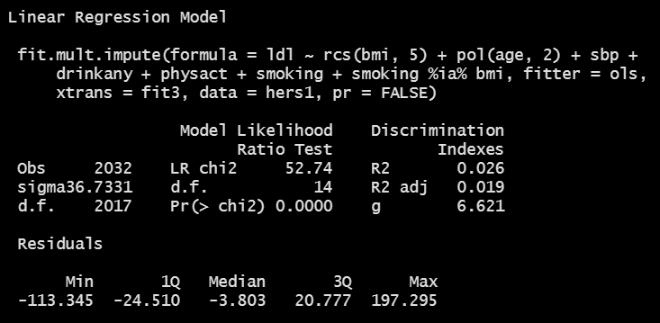
```


## `m3imp` results (screen 2/2)

```{r, eval = FALSE}
m3imp
```

```{r, echo = FALSE, fig.align = "center", out.width = '90%'}
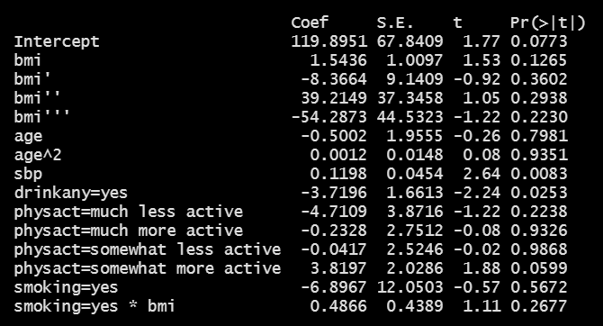
```

## ANOVA results for `m3imp`

```{r, eval = FALSE}
anova(m3imp)
```

```{r, echo = FALSE, fig.align = "center", out.width = '90%'}
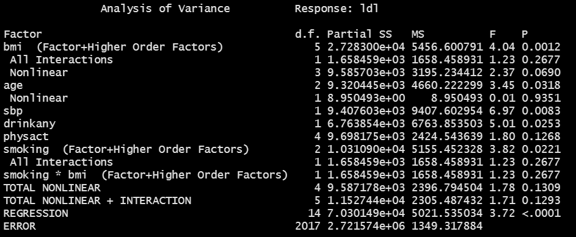
```

## Summary of Effect Estimates for `m3imp`

```{r, eval = FALSE}
summary(m3imp)
```

```{r, echo = FALSE, fig.align = "center", out.width = '90%'}
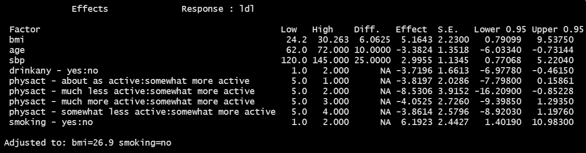
```

## `plot(summary(m3imp))`

```{r, echo = FALSE, fig.height = 6}
plot(summary(m3imp))
```

## Evaluation via Partial R^2^ and AIC (code)

```{r, eval = FALSE}
par(mfrow = c(1,2))
plot(anova(m3imp), what="partial R2")
plot(anova(m3imp), what="aic")
par(mfrow = c(1,1))
```

## Evaluation via Partial R^2^ and AIC (result)

```{r, echo = FALSE}
par(mfrow = c(1,2))
plot(anova(m3imp), what="partial R2")
plot(anova(m3imp), what="aic")
par(mfrow = c(1,1))
```

## `plot(nomogram(m3imp))`

```{r, echo = FALSE}
plot(nomogram(m3imp))
```

## `plot(resid(m3imp) ~ fitted(m3imp))`

```{r, echo = FALSE}
plot(resid(m3imp) ~ fitted(m3imp))
```


## Next Step

Can we do all of this for a logistic regression model?