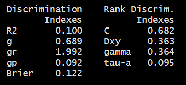

```{r set-options, echo=FALSE, cache=FALSE}
knitr::opts_chunk$set(comment=NA)
options(width = 60)
```

## Today's Agenda

Fitting and evaluating logistic regression models with `lrm`

- The framingham example
    - Outcome: `chd10` = Developed coronary heart disease in next 10 years?
    - Creating "complete case" data: `fram_cc`
    - Single Imputation of Missing Values: `fram_sh`
- Use `lrm` to predict `chd10` using `glucose`, `smoker`, `sbp` and `educ`
    - on the complete cases (`fram_cc`)
    - accounting for missingness via single imputation (`fram_sh`)
    - accounting for missingness via multiple imputation
- Consider adding non-linear terms, refit and re-evaluate

## Setup

```{r, warning = FALSE, message = FALSE}
library(magrittr); library(janitor)
library(here); library(knitr)
library(naniar); library(simputation)
library(ROCR)       # one way to draw ROC curves
library(rms) 
library(tidyverse)

theme_set(theme_bw())
```

### Today's Data

```{r, message = FALSE}
fram_raw <- read_csv(here("data/framingham.csv")) %>%
    clean_names() 
```

See https://www.framinghamheartstudy.org/ for more details. This particular data set has been used by lots of people, in varied settings, with variations all over the net. I don't know who the originators were.

# Managing the Framingham Data

## Data Cleanup

```{r}
fram <- fram_raw %>%
    mutate(educ = 
               fct_recode(factor(education), 
                          "Some HS" = "1",
                          "HS grad" = "2",
                          "Some Coll" = "3",
                          "Coll grad" = "4")) %>%
    rename(smoker = "current_smoker",
           cigs = "cigs_per_day",
           stroke = "prevalent_stroke",
           highbp = "prevalent_hyp",
           chol = "tot_chol",
           sbp = "sys_bp", dbp = "dia_bp",
           hrate = "heart_rate",
           chd10 = "ten_year_chd") %>%
    select(subj_id, chd10, educ, glucose, sbp, smoker,
           everything()) %>% select(-education)
```

## Data Descriptions (Main Variables Today)

The variables describe n = `r nrow(fram)` adults examined at baseline, then followed for 10 years to see if they developed incident coronary heart disease. 

The main variables we'll use today in developing outcome models are:

Variable | Description
-------: | ------------------------------------------------
`subj_id` | identifying code added by Dr. Love
**`chd10`** | 1 = coronary heart disease in next 10 years
**`educ`** | four-level factor: educational attainment
**`glucose`** | blood glucose level in mg/dl
**`sbp`** | systolic blood pressure (mm Hg)
**`smoker`** | 1 = current smoker at time of examination, else 0

## Data Descriptions (Other 11 variables)

Here are the other 11 variables in the `fram` data.

Variable | Description
-------: | ------------------------------------------------
`male` | 1 = subject is male, else 0
`age` | in years (range is 32 to 70)
`cigs`  | number of cigarettes smoked per day
`bp_meds` | 1 = using anti-hypertensive medication at time of exam
`stroke` | 1 = history of stroke, else 0
`highbp` | 1 = under treatment for hypertension, else 0
`diabetes` | 1 = history of diabetes, else 0
`chol` | total cholesterol (mg/dl)
`dbp` | diastolic blood pressure (mm Hg)
`bmi` | body mass index in $kg/m^2$
`hrate` | heart rate in beats per minute

## Missing Data?

Our outcome `chd10` has no missing values.

```{r}
fram %>% tabyl(chd10) %>% adorn_pct_formatting(digits = 1)
```

- `r n_case_complete(fram)` (`r round(pct_complete_case(fram),1)`%) of the `r nrow(fram)` subjects in the `fram` data are complete. 
- The remaining `r n_case_miss(fram)` observations have something missing.

```{r}
n_case_complete(fram); pct_complete_case(fram)
```

## Which variables are missing data?

```{r, fig.height = 5}
gg_miss_var(fram)
```

## Counts of Missing Data, by Variable

```{r}
miss_var_summary(fram) %>% 
    filter(n_miss > 0)
```

## Single Imputation

We will impute:

- 5 quantitative variables (`glucose`, `bmi`, `cigs`, `chol` and `hrate`)
- 1 binary variable (`bp_meds`), and
- 1 multi-categorical variable (`educ`)

```{r}
fram_sh <- bind_shadow(fram)

fram_sh <- fram_sh %>%
    data.frame() %>%
    impute_pmm(., bp_meds ~ highbp + sbp + dbp) %>%
    impute_cart(., educ ~ age + smoker + male) %>%
    impute_pmm(., cigs ~ smoker) %>%
    impute_rlm(., glucose + chol + hrate + bmi ~ 
                sbp + diabetes + age + highbp + stroke) %>%
    tibble()
```

## Check multi-categorical single imputation?

```{r}
fram_sh %>% count(educ_NA, educ)
```

Do the values seem reasonable?

## Data Sets for the rest of our work

```{r}
fram_start <- fram %>% 
  select(subj_id, chd10, glucose, smoker, sbp, educ)

fram_cc <- fram_start %>%
  drop_na()

fram_sh <- fram_sh  %>% 
  select(subj_id, chd10, glucose, smoker, sbp, educ,
         glucose_NA, educ_NA)
```

- `fram_start` includes all `r nrow(fram_start)` rows and the `r ncol(fram_start)` columns we'll use, including `r n_miss(fram_start$glucose)` rows missing `glucose` and `r n_miss(fram_start$educ)` missing `educ`.
- `fram_cc` includes only the `r nrow(fram_cc)` complete rows on the `r ncol(fram_cc)` columns.
- `fram_sh` uses single imputation to get `r nrow(fram_sh)` complete rows, on `r ncol(fram_sh)` columns, including the useful missingness indicators.

## Modeling Plan

Use `lrm` to fit a four-predictor logistic regression model to predict `chd10` using `glucose`, `smoker`, `sbp` and `educ`

1. Using the complete cases (`fram_cc`)
2. Accounting for missingness via single imputation (`fram_sh`)
3. Accounting for missingness via multiple imputation

Then, we'll consider adding several non-linear terms to the "four-predictor" models, and refit.

# Fitting a Four-Predictor Model using Complete Cases

## A "Four Predictor" model

First, we'll use the `fram_cc` data to perform a complete-case analysis and fix ideas.

```{r}
d <- datadist(fram_cc)
options(datadist = "d")

mod_cc <- lrm(chd10 ~ glucose + smoker + sbp + educ,
            data = fram_cc, x = TRUE, y = TRUE)
```

## Main Output for `mod_cc`

```{r, eval = FALSE}
mod_cc
```

```{r, echo = FALSE, fig.align = "center", out.width = '90%'}

```

- We'll walk through these summaries in the next few slides. 
- Notes Section 12.14 provides additional details.

## Deconstructing the `mod_cc` summaries (1/5)

```{r, echo = FALSE, fig.align = "center", out.width = '30%'}

```


- `Obs` = The number of observations used to fit the model, with `0` = the number of zeros and `1` = the number of ones in our outcome, `chd10`. 
- Also specified is the maximum absolute value of the derivative at the point where the maximum likelihood function was estimated. 

All you're likely to care about is whether the iterative function-fitting process converged, and R will warn you in other ways if it doesn't.

## Deconstructing the `mod_cc` summaries (2/5)

```{r, echo = FALSE, fig.align = "center", out.width = '30%'}

```

- This is a global likelihood ratio test (drop in deviance test.)
- Likelihood Ratio $\chi^2$ statistic = null deviance - residual deviance
    - d.f. = null degrees of freedom - residual degrees of freedom
- Pr(> chi2) is a *p* value obtained from comparison to a $\chi^2$ distribution with appropriate d.f.

It's not saying much to suggest that some part of this logistic regression model has some detectable predictive value. 

- The null hypothesis here (that the model has no predictive value at all) is rarely interesting in practical work.

## Deconstructing the `mod_cc` summaries (3/4)

```{r, echo = FALSE, fig.align = "center", out.width = '80%'}

```

- How does each predictor appear to relate to 10-year risk?
    - Which is the baseline `educ` category?
    - Remember that these estimates are on the logit scale.
    - See the effect size discussion linked in today's README.

## Plot of Effects using `mod_cc`

```{r, fig.height = 5}
plot(summary(mod_cc))
```

## Effect Size Summary for `mod_cc`

```{r, eval = FALSE}
summary(mod_cc)
```

```{r, echo = FALSE, fig.align = "center", out.width = '80%'}

```

## Predict results for `mod_cc`

```{r, fig.height = 5}
ggplot(Predict(mod_cc, fun = plogis))
```

## Deconstructing the `mod_cc` summaries (4/4)

```{r, echo = FALSE, fig.align = "center", out.width = '50%'}

```

The key indexes for our purposes are:

- Nagelkerke $R^2$, symbolized `R2` here.
- The Brier score, symbolized `Brier`.
- The area under the ROC curve, or C statistic, shown as `C`.
- Somers' d statistic, symbolized `Dxy` here.

Let's walk through each of those, in turn.

## Key Indexes (Nagelkerke $R^2$)

- In our model, Nagelkerke $R^2$ = 0.100

There are at least three ways to think about $R^2$ in linear regression, but when you move to a categorical outcome, not all of those ways can be expressed in the same statistic. See our Course Notes Section 10 for details.

The Nagelkerke $R^2$:

- reaches 1 if the fitted model shows as much improvement as possible over the null model (which just predicts the mean response on the 0-1 scale for all subjects).
- is 0 for the null model
- is larger (closer to 1) as the fitted model improves, although it's been criticized for being misleadingly high, 
- AND a value of 0.100 no longer means 10% of anything.

A value of 0.100 indicates a model of pretty poor quality.

## An Alternative: McFadden's $R^2$

Consider the McFadden R-square, which can be defined as 1 minus the ratio of (the model deviance over the deviance for the intercept-only model.) 

To obtain this for our `mod_cc` run with `lrm`, we can use:

```{r}
1 - (mod_cc$deviance[2] / mod_cc$deviance[1])
```

This McFadden $R^2$ corresponds well to the proportionate reduction in error interpretation of an $R^2$, but some people don't like it as well.

## Key Indexes (Brier Score = 0.122)

- The lower the Brier score, the better the predictions are calibrated. 
- The maximum (worst) score is 1, the best is 0.

From Wikipedia: Suppose you're forecasting the probability P that it will rain on a given day.

- If the forecast is P = 1 (100%) and it rains, the Brier Score is 0.
- If the forecast is P = 1 (100%) and it doesn't rain, the Brier Score is 1.
- If the forecast is P = 0.7 and it rains, Brier = $(0.70 - 1)^2 = 0.09$.
- If the forecast is P = 0.3 and it rains, Brier = $(0.30 - 1)^2 = 0.49$.
- If the forecast is P = 0.5, the Brier score is $(0.50 - 1)^2 = 0.25$ regardless of whether it rains.

The Brier score can also be decomposed to assess calibration and discrimination separately.

## Receiver Operating Characteristic Curve Analysis

One way to assess the predictive accuracy within the model development sample in a logistic regression is to consider an analyses based on the receiver operating characteristic (ROC) curve. ROC curves are commonly used in assessing diagnoses in medical settings, and in signal detection applications.

The accuracy of a test can be evaluated by considering two types of errors: false positives and false negatives.

See Section 12.9 of our Course Notes for more details.

## The C statistic (area under ROC curve) = 0.682

The C statistic and Somers' d (Dxy) are connected:

$$
C = 0.5 + \frac{d}{2}, d = 2(C - .5)
$$

The C statistic ranges from 0 to 1.

- C = 0.5 describes a prediction that is exactly as good as random guessing
- C = 1 indicates a perfect prediction model, one that guesses "yes" for all patients with `chd10` = 1 and which guesses "no" for all patients with `chd10` = 0.
- Most of the time, the closer to 1, the happier we are:
    - $C \geq 0.8$ usually indicates a moderately strong model (good discrimination)
    - $C \geq 0.9$ indicates a very strong model (excellent discrimination)

So 0.682 isn't good.

## ROC Curve for our `mod_cc`

```{r, echo = FALSE}
## requires ROCR package
prob <- predict(mod_cc, type="fitted")
pred <- prediction(prob, fram_cc$chd10)
perf <- performance(pred, measure = "tpr", x.measure = "fpr")
auc <- performance(pred, measure="auc")

auc <- round(auc@y.values[[1]],3)
roc.data <- data.frame(fpr=unlist(perf@x.values),
                       tpr=unlist(perf@y.values),
                       model="GLM")

ggplot(roc.data, aes(x=fpr, ymin=0, ymax=tpr)) +
    geom_ribbon(alpha=0.2, fill = "blue") +
    geom_line(aes(y=tpr), col = "blue") +
    geom_abline(intercept = 0, slope = 1, lty = "dashed") +
    labs(title = paste0("mod_cc: ROC Curve w/ AUC=", auc))
```

## Code for Previous Slide

```{r, eval = FALSE}
## requires ROCR package
prob <- predict(mod_cc, type="fitted")
pred <- prediction(prob, fram_cc$chd10)
perf <- performance(pred, measure = "tpr", x.measure = "fpr")
auc <- performance(pred, measure="auc")

auc <- round(auc@y.values[[1]],3)
roc.data <- data.frame(fpr=unlist(perf@x.values),
                       tpr=unlist(perf@y.values),
                       model="GLM")

ggplot(roc.data, aes(x=fpr, ymin=0, ymax=tpr)) +
    geom_ribbon(alpha=0.2, fill = "blue") +
    geom_line(aes(y=tpr), col = "blue") +
    geom_abline(intercept = 0, slope = 1, lty = "dashed") +
    labs(title = paste0("Model A: ROC Curve w/ AUC=", auc))
```

## ROC Curve for a Simple Model (`glucose` only)

```{r, echo = FALSE}
d <- datadist(fram_cc)
options(datadist = "d")

mod_glucose <- lrm(chd10 ~ glucose,
            data = fram_cc, x = TRUE, y = TRUE)

## requires ROCR package
prob <- predict(mod_glucose, type="fitted")
pred <- prediction(prob, fram_cc$chd10)
perf <- performance(pred, measure = "tpr", x.measure = "fpr")
auc <- performance(pred, measure="auc")

auc <- round(auc@y.values[[1]],3)
roc.data <- data.frame(fpr=unlist(perf@x.values),
                       tpr=unlist(perf@y.values),
                       model="GLM")

ggplot(roc.data, aes(x=fpr, ymin=0, ymax=tpr)) +
    geom_ribbon(alpha=0.2, fill = "blue") +
    geom_line(aes(y=tpr), col = "blue") +
    geom_abline(intercept = 0, slope = 1, lty = "dashed") +
    labs(title = paste0("glucose only Model: ROC Curve w/ AUC=", auc))
```

## Validate Summary Statistics for `mod_cc`

- Usual approach (as in `ols`) to correcting for over-optimism through bootstrap validation, now using 50 bootstrap resamples instead of 40.

```{r, eval = FALSE}
set.seed(432)
validate(mod_cc, B = 50)
```

```{r, echo = FALSE, fig.align = "center", out.width = '80%'}

```

- Summaries we'll focus on here are `Dxy`, `R2` and `B`
- Remember that $C = 0.5 + \frac{Dxy}{2}$, so our validated C statistic would be 0.5 + (0.3562/2) = 0.6781

## ANOVA for `mod_cc`

Model `mod_cc` uses 6 degrees of freedom.

```{r}
anova(mod_cc)
```

## ANOVA for Model `mod_cc`

```{r, fig.height = 5}
plot(anova(mod_cc))
```

## Nomogram for `mod_cc`

```{r, fig.height = 6}
plot(nomogram(mod_cc, fun = plogis,
            funlabel = "Pr(CHD)"))
```

# Using the Singly Imputed Data to fit the 4-predictor Model

## Fit `mod_si` which is `mod_cc` after single imputation

```{r}
d <- datadist(fram_sh)
options(datadist = "d")

mod_si <- lrm(chd10 ~ glucose + smoker + sbp + educ,
            data = fram_sh, x = TRUE, y = TRUE)
```

## Model `mod_si` with single imputation

```{r, eval = FALSE}
mod_si
```

```{r, echo = FALSE, fig.align = "center", out.width = '90%'}

```

## Comparing the Coefficients (exponentiated)

- Comparing the slopes as odds ratios

```{r}
round_half_up(exp(mod_cc$coefficients),3)
```

```{r}
round_half_up(exp(mod_si$coefficients),3)
```

## Edited Summaries Comparing The Models

Summary | `mod_si` value | `mod_cc` value
-------: | -------: | -------:
Obs | 4238 | 3753
0 | 3594 | 3174
1 | 644 | 579
Nagelkerke $R^2$ | 0.095 | 0.100
Brier Score | 0.121 | 0.122
C | 0.677 | 0.682
Dxy | 0.354 | 0.363

- All of these results came from 

```{r, eval = FALSE}
mod_cc
mod_si
```

## Validate `mod_si` Summary Statistics

```{r, eval = FALSE}
set.seed(432)
validate(mod_si, B = 50)
```


```{r, echo = FALSE, fig.align = "center", out.width = '90%'}

```

- Again, $C = 0.5 + \frac{Dxy}{2}$, so the corrected C statistic estimate will be 0.5 + (0.348/2) = 0.674

## Plot of Effects using `mod_si`

```{r, fig.height = 5}
plot(summary(mod_si))
```

## Predict results for `mod_si`

```{r, fig.height = 5}
ggplot(Predict(mod_si, fun = plogis))
```

## Nomogram for `mod_si`

```{r, fig.height = 5}
plot(nomogram(mod_si, fun = plogis,
            fun.at = c(0.05, seq(0.1, 0.9, by = 0.1), 0.95),
            funlabel = "Pr(CHD)"))
```

- `fun.at` used to show us specific Pr(CHD) cutpoints

# Using Multiple Imputation: The 4-predictor Model

## Fit the Imputation Model first

We'll use `aregImpute` here, and create 30 imputed sets.

```{r, message = FALSE}
set.seed(432)
dd <- datadist(fram)
options(datadist = "dd")

fit_imp <- 
    aregImpute(~ chd10 + glucose + smoker + sbp + educ, 
               nk = c(0, 3:5), tlinear = FALSE, data = fram,
               B = 10, n.impute = 30)
```

## Imputation Results (abbreviated output)

```{r, eval = FALSE}
fit_imp
```


```{r, echo = FALSE, fig.align = "center", out.width = '85%'}

```

## Multiply Imputed Values, via `plot(fit_imp)`

```{r, echo = FALSE, fig.height = 6}
par(mfrow=c(1,2))
plot(fit_imp)
par(mfrow = c(1,1))
```

## What do we need to do our multiple imputation?

- Imputation Model

```{r, eval = FALSE}
fit_imp <- 
    aregImpute(~ chd10 + glucose + smoker + sbp + educ, 
               nk = c(0, 3:5), tlinear = FALSE, data = fram,
               B = 10, n.impute = 30)
```

- Outcome Model will be of the following form...

```{r, eval = FALSE}
lrm(chd10 ~ glucose + smoker + sbp + educ, 
    x = TRUE, y = TRUE)
```

## Fitting `mod_mi` (`mod_cc` with multiple imputation)

```{r}
mod_mi <- 
    fit.mult.impute(chd10 ~ glucose + smoker + sbp + educ,
                    fitter = lrm, xtrans = fit_imp, 
                    data = fram_start, x = TRUE, y = TRUE, 
                    pr = FALSE)
```

- `data = fram_start` (which includes NA values)
- `xtrans = fit_imp` (results from multiple imputation)
- `fitter = lrm` (we could actually use `glm` too)
- `pr = FALSE` avoids a long printout we don't need

## Model `mod_mi` with multiple imputation

```{r, eval = FALSE}
mod_mi
```

```{r, echo = FALSE, fig.align = "center", out.width = '90%'}

```

## Comparing the Coefficients (exponentiated)

- I'll just compare the two models using imputation...

```{r}
round_half_up(exp(mod_mi$coefficients),3)
```

```{r}
round_half_up(exp(mod_si$coefficients),3)
```

## Plot of Effects using `mod_mi`

```{r, fig.height = 5}
plot(summary(mod_mi))
```

## Edited Summaries Comparing Our 3 Models

Summary | `mod_mi` value | `mod_si` value | `mod_cc` value
-------: | -------: | -------: | -------:
Obs | 4238 | 4238 | 3753
0 | 3594 | 3594 | 3174
1 | 644 | 644 | 579
Nagelkerke $R^2$ | 0.095 | 0.095 | 0.100
Brier Score | 0.121 | 0.121 | 0.122
C | 0.677 | 0.677 | 0.682
Dxy | 0.354 | 0.354 | 0.363

- It's just a coincidence that the `mod_mi` and `mod_si` values are identical to the level of precision provided in this table. 
- What might cause the values to look meaningfully different?

## Validate `mod_mi` Summary Statistics

```{r, eval = FALSE}
set.seed(432)
validate(mod_mi, B = 50)
```


```{r, echo = FALSE, fig.align = "center", out.width = '90%'}

```

- Optimism-corrected C statistic estimate is 0.5 + (0.3477/2) = 0.674

## Predict results for `mod_mi`

```{r, fig.height = 5}
ggplot(Predict(mod_mi, fun = plogis))
```

## Nomogram for `mod_mi`

```{r, fig.height = 6}
plot(nomogram(mod_mi, fun = plogis,
            funlabel = "Pr(CHD)"))
```


# Considering Non-Linear Terms

## Spearman $\rho^2$ Plot

```{r, fig.height = 5}
plot(spearman2(chd10 ~ glucose + smoker + sbp + educ,
               data = fram_sh))
```

## Adding some non-linear terms

- We'll add a restricted cubic spline with 5 knots in `sbp`
- and an interaction between the `educ` factor and the linear effect of `sbp`,
- and a quadratic polynomial in `glucose`

to our main effects model, just to show how to do them...

- I'll just show the results including the multiple imputation, since if you can get those, you should have little difficulty instead applying the single imputation or the complete case analysis.

## `mod_big` incorporating multiple imputation

Our `mod_big` will incorporate several non-linear terms.

```{r}
mod_big <- 
    fit.mult.impute(
      chd10 ~ rcs(sbp, 5) + pol(glucose, 2) + 
                smoker + educ + educ %ia% sbp,
      fitter = lrm, xtrans = fit_imp, 
      data = fram_start, x = TRUE, y = TRUE, 
      pr = FALSE)
```

## The `mod_big` model with non-linear terms

```{r, echo = FALSE, fig.align = "center", out.width = '85%'}

```

## `mod_big` vs. `mod_mi` comparison

Summary | `mod_big` | `mod_mi` 
-------: | -------: | -------: 
Obs | 4238 | 4238
0 | 3594 | 3594
1 | 644 | 644
Nagelkerke $R^2$ | 0.098 | 0.095 
Brier Score | 0.120 | 0.121
C | 0.679 | 0.677
Dxy | 0.357 | 0.354

## ROC Curve for `mod_big`

```{r, echo = FALSE}
## requires ROCR package
prob <- predict(mod_big, type="fitted")
pred <- prediction(prob, fram$chd10)
perf <- performance(pred, measure = "tpr", x.measure = "fpr")
auc <- performance(pred, measure="auc")

auc <- round(auc@y.values[[1]],3)
roc.data <- data.frame(fpr=unlist(perf@x.values),
                       tpr=unlist(perf@y.values),
                       model="GLM")

ggplot(roc.data, aes(x=fpr, ymin=0, ymax=tpr)) +
    geom_ribbon(alpha=0.2, fill = "blue") +
    geom_line(aes(y=tpr), col = "blue") +
    geom_abline(intercept = 0, slope = 1, lty = "dashed") +
    labs(title = paste0("Big Model: ROC Curve w/ AUC=", auc))
```

## What does ANOVA suggest about the fit?

```{r, eval = FALSE}
anova(mod_big)
```

```{r, echo = FALSE, fig.align = "center", out.width = '85%'}

```

## `plot(anova(mod_big))` (model includes 13 df)

```{r, echo = FALSE, fig.height = 6}
plot(anova(mod_big))
```

## Validate `mod_big` Summary Statistics

```{r, eval = FALSE}
set.seed(432)
validate(mod_big, B = 50)
```

```{r, echo = FALSE, fig.align = "center", out.width = '90%'}

```

- Optimism-Corrected C = 0.5 + (.3434/2) = .672

## Plot of Effects using `mod_big`

```{r, fig.height = 5}
plot(summary(mod_big))
```

## Predict results for `mod_big`

```{r, fig.height = 5}
ggplot(Predict(mod_big, fun = plogis))
```

## Nomogram for `mod_big`

```{r, fig.height = 6}
plot(nomogram(mod_big, fun = plogis, funlabel = "Pr(CHD)"))
```

## What's Next?

- Using the `tidymodels` framework to fit linear and logistic regression models

