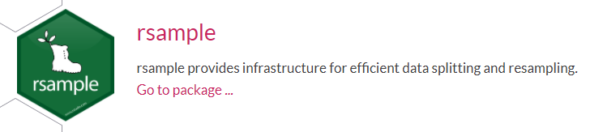
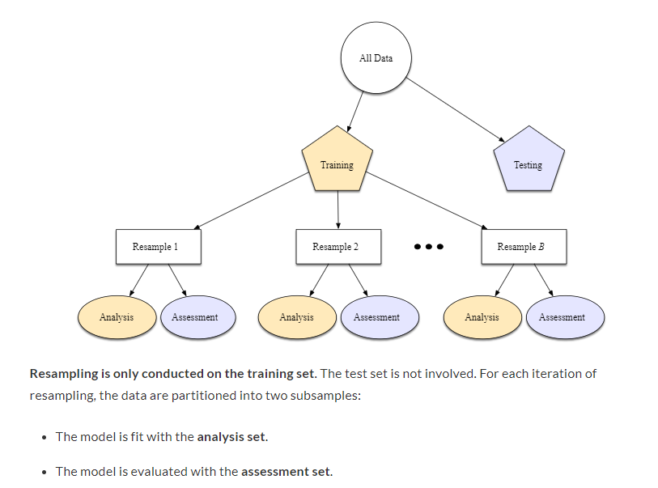
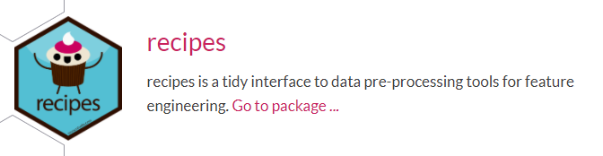
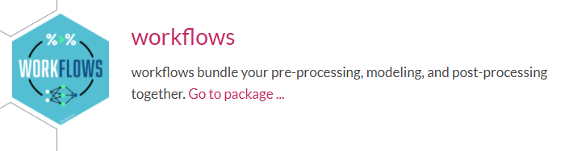
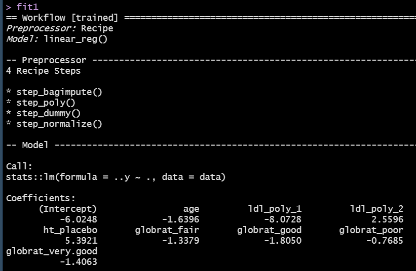
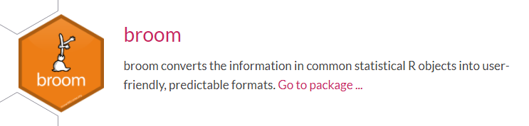
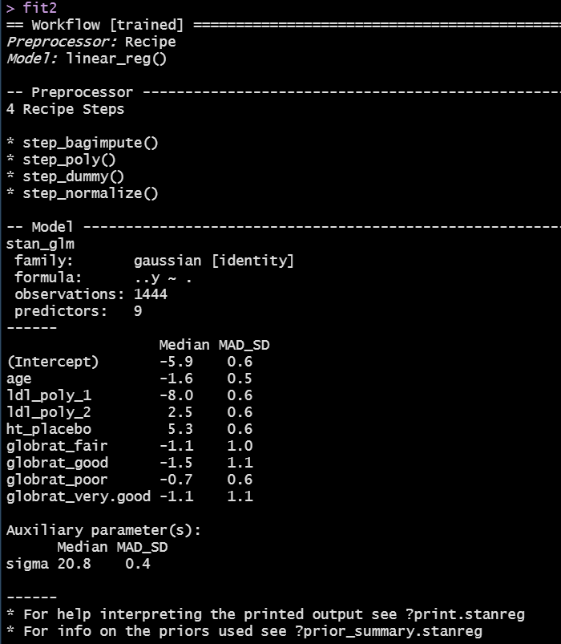
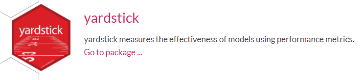

```{r set-options, echo=FALSE, cache=FALSE}
knitr::opts_chunk$set(comment=NA)
options(width = 60)
```

## Today's Agenda

The tidymodels framework

- Using `tidymodels` tools to develop a linear regression model
    - Pre-processing activities
    - Model building (with multiple fitting engines)
    - Measuring model effectiveness
    - Creating a model workflow

### Next Time (Class 11)

- Using tidymodels tools to develop a logistic regression model

## Setup

```{r, message = FALSE}
library(here); library(conflicted)
library(knitr); library(magrittr); library(janitor)

library(tidymodels)
library(tidyverse)

theme_set(theme_bw())

conflict_prefer("select", "dplyr")
conflict_prefer("filter", "dplyr")
```


## Regression Frameworks

Generally, regression allows us to summarize how predictions (or average values) of an outcome vary across individuals defined by a set of predictors. Some of the most important uses of regression are:

- **Prediction**, which involves both modeling existing observations and forecasting new data.
- **Exploring Associations**, where we summarize how well a set of variables predicts the outcome.
- **Extrapolation**, where we are adjusting for known differences between the observed sample of data and a population of interest.
- **Causal Inference**, where we are estimating the effect of a treatment, by comparing outcomes under treatment or control, or under different levels of a treatment\footnote{My 500 course spends a whole semester on one important part of this subject.}.

Source: Gelman, Hill and Vehtari, *Regression and Other Stories*

## Research Questions for Regression Models

- "How effectively can [insert quantitative outcome] be predicted using [insert predictor(s)]?" for a linear regression project, and
- "How effectively can [insert binary outcome] be predicted using [insert predictor(s)]?" for a logistic regression project.

If you're struggling with this, or if your research question isn't in the form of a question, consider these approaches. Advantages:

1. regression can help provide an answer to these questions and in discussing your results you'll need to answer the questions 
2. framing models in terms of exploring associations has some value for the tools we're discussing and 
3. it's pretty clear what you're doing, based just on your research question.

If you're doing something else, I still need to think that you meet standards (1) and (3) at least.

## Using R to fit Regression Models

For linear models, we have:

- `lm` to fit models for quantitative outcomes, compute and plot predictions and residuals, obtain confidence intervals, etc.
- `ols` from the `rms` package to save and explore additional components of the model's fit and to (slightly) expand the capacity for `lm` fits to incorporate non-linear terms and multiple imputations.

For logistic models, we have:

- `glm` to fit models for binary outcomes, compute and plot predictions, hypothesis tests and confidence intervals
- `lrm` from `rms` to save and explore additional components of the model's fit and to (slightly) expand the capacity for `lm` fits to incorporate non-linear terms and multiple imputations.

These are by no means the only options for fitting or working with models.

## What are `tidymodels`?

The `tidymodels` collection of packages in R use tidyverse principles to facilitate modeling and machine learning work. The key idea is to develop a consistent framework for modeling, including:

- pre-processing data, which includes identifying variables and their roles, re-expression of outcomes, creation of features (predictors) 
- building a model (potentially with multiple fitting "engines")
- developing a re-usable workflow 
- evaluating the fit of one model or various models with a variety of validation strategies

Visit the `tidymodels` website at https://www.tidymodels.org/.

## Core Tidymodels Packages

Install many of the packages in the `tidymodels` ecosystem with `install.packages(tidymodels)`.

When you use `library(tidymodels)`, this makes the core packages available in your R session. They include:

- `rsample` which will help with data splitting and reasmpling
- `parsnip` which provides a tidy, unified interface for models
- `recipes` for data pre-processing and feature engineering
- `yardstick` for measuring model effectiveness
- `broom` for converting R objects into predictable formats
- `workflows` for bundling together pre-processing, modeling and post-processing work

as well as `dials` and `tune`, which help manage and optimize tuning parameters in certain types of models.

## Today's Data (from Class 08)

Heart and Estrogen/Progestin Study (HERS)

- Clinical trial of hormone therapy for the prevention of recurrent heart attacks and deaths among 2763 post-menopausal women with existing coronary heart disease (see Hulley et al 1998 and many subsequent references, including Vittinghoff, Chapter 4.)
- We're excluding the women in the trial with a diabetes diagnosis and those with missing LDL values.

```{r, message = FALSE}
hers_raw <- read_csv(here("data/hersdata.csv")) %>% 
    clean_names()

hers_new <- hers_raw %>%
    filter(diabetes == "no") %>%
    filter(complete.cases(ldl1, ldl)) %>%
    select(subject, ldl1, ldl, age, ht, globrat)
```

## `hers_new` Codebook (n = `r nrow(hers_new)`)

Variable   | Description 
---------: | --------------------------------- 
`subject`  | subject code 
`ht`       | factor: hormone therapy or placebo 
`ldl`      | baseline LDL cholesterol in mg/dl 
`age`      | baseline age in years 
`globrat`  | baseline self-reported health (5 levels)
`ldl1`     | LDL at first annual study visit
`diabetes` | yes or no (all are no in our sample)

**Goal** Predict percentage change in `ldl` from baseline to followup, using baseline `age`, `ht`, `ldl` and `globrat`, restricted to women without `diabetes`.

## Steps we'll describe today

1. Create our outcome and consider a transformation.
2. Split the data into training and testing samples.
3. Build a recipe for our model.
    - Specify roles for outcome and predictors.
    - Deal with missing data in a reasonable way.
    - Complete all necessary pre-processing so we can fit models.
4. Specify a modeling engine for each fit we will create.
    - There are five available engines just for linear regression!
5. Create a workflow for each engine and fit model to the training data.
6. Compare coefficients graphically from two modeling approaches.
7. Assess performance in the models we create in the training data.
8. Compare multiple models based on their performance in test data.

Key Reference: Kuhn and Silge, *Tidy Modeling with R* or TMWR

## Stage 1: Create our outcome

```{r}
hers_new <- hers_new %>%
    mutate(ldl_pch = 100*(ldl1 - ldl)/ldl)
```

```{r, echo = FALSE, message = FALSE, fig.height = 3}
ggplot(hers_new, aes(x = ldl_pch, y = 1)) +
    geom_violin(fill = "peachpuff") + 
    geom_boxplot(width = 0.3, outlier.size = 2, notch = TRUE) +
    guides(fill = FALSE) +
    theme(axis.text.y = element_blank(),
          axis.ticks.y = element_blank()) +
    labs(y = "", x = "Percentage Change in LDL after One Year")

mosaic::favstats(~ ldl_pch, data = hers_new) %>%
    kable(digits = 1)
```

## Stage 2: Creating Training and Test Samples

```{r, echo = FALSE, fig.align = "center", out.width = '75%'}

```

Here, we'll use the `rsample` package to split our data.

```{r}
set.seed(20210309)
hers_split <- initial_split(hers_new, prob = 0.8)

hers_train <- training(hers_split)
hers_test <- testing(hers_split)
```

We start with `r nrow(hers_new)` women in `hers_new`, which we split into `r nrow(hers_train)` women in the training sample, leaving `r nrow(hers_test)` women in the testing sample.

## What else can we do with `rsample`?

- Stratified sampling (splitting) on a categorical variable to ensure similar distributions of those categories in the training and testing groups.

```
initial_split(hers_new, prob = 0.8, strata = ht)
```

- What if you have time series data? 
    - Use `initial_time_split()` to identify the first part of the data as the training set and the rest in the testing set; this assumes the data were pre-sorted in a sensible order.

The test set should **always** resemble new data that will be given to the model.

> A test set should be avoided only when the data are pathologically small.

- TMWR, Section 5.2

## What about a validation set?

- Would like to avoid overfitting (where the models do much better on the training set samples than you do on the test set)
- Idea is to hold back a validation set of data to measure performance while training prior to moving on with a model to the test set.
- This is really just a special case of a resampling method used on the training set, as described in TMWR section 10 (see next slide).

## From TMWR, Section 10.2

```{r, echo = FALSE, fig.align = "center", out.height = '85%'}

```

## Stage 3: Pre-Processing the Data 

```{r, echo = FALSE, fig.align = "center", out.width = '75%'}

```

We'll build a **recipe** for our pre-modeling work. This might include:

- establishing the roles (outcome, predictors, identifiers) for variables
- pre-processing steps for predictors (feature engineering)
    - transforming predictors, including all of our usual power transformations, but also centering, scaling or normalizing and more complex mutations
    - creating dummy (indicator) variables for categorical data
    - dealing with factors and factor levels
    - including interactions, polynomials or splines
    - filtering out variables with zero variance
    - dealing with missing data via imputation or removal

https://www.tidymodels.org/find/recipes/ lists all available recipes

## Building a Recipe for our modeling

```{r}
hers_rec <- 
    recipe(ldl_pch ~ age + ht + ldl + globrat, 
           data = hers_new) %>%                    # 1
    step_bagimpute(all_predictors()) %>%           # 2
    step_poly(ldl, degree = 2) %>%                 # 3
    step_dummy(all_nominal()) %>%                  # 4
    step_normalize(all_predictors())               # 5
```

1. Specify the roles for the outcome and the predictors.
2. Impute missing predictors with bagged tree models.
3. Use an orthogonal polynomial of degree 2 with the baseline LDL data.
4. Form dummy variables to represent all categorical variables.
5. Normalize (subtract mean and divide by SD) all quantitative predictors.

## Column Roles 

```
hers_rec <- 
    recipe(ldl_pch ~ age + ht + ldl + globrat, 
           data = hers_new)
```

- Everything to the left of the `~` is an outcome.
- Everything to the right of the `~` is a predictor.

Sometimes we want to assign other roles, like "id" for an important identifier that isn’t either a predictor or an outcome, or "split" for a splitting variable.

- Any character string can be a role, and columns can have multiple roles
- `add_role()`, `remove_role()` and `update_role()` functions are helpful


## Common steps used in building a recipe (1/5)

- Power Transformations of Predictors
    - `step_log(x1, base = 10)` (default base is exp(1)), `step_sqrt`, `step_inverse`
    - `step_BoxCox()` will transform predictors using a simple Box-Cox transformation to make them more symmetric  (remember this does require a strictly positive variable, and will be something we’d use more for an outcome using the residuals for a statistical model).
    - `step_YeoJohnson()` uses the Yeo_Johnson transformation (again, typically on the outcome model) which is like Box-Cox but doesn’t require the input variables to be strictly positive.
- `step_logit` and `step_invlogit`
- Non-Linear Terms for Quantitative Predictors
    - `step_poly()` produces orthogonal polynomial basis functions
    - `step_ns(x5, deg_free = 10)` from the `splines` package can create things called natural splines - the number of spline terms is a tuning parameter, `step_bs()` adds B-spline basis functions    

## Common steps used in building a recipe (2/5)

- Dealing with Categorical Predictors
    - `step_dummy(all_nominal())` which converts all factor or categorical variables into indicator (also called dummy) variables: numeric variables which take 1 and 0 as values to encode the categorical information
        - Other helpful selectors: `all_numeric()`, `all_predictors()` and `all_outcomes()`
        - If you want to select specific variables, you could use `step_dummy(x2, x3)`
    - `step_relevel()` reorders the provided factor columns so that a level you specify is first (the baseline)
    - If you have ordered factors in R, try `step_unorder()` to convert to regular factors or `step_ordinalscore()` to map specific numeric values to each factor level

## Common steps used in building a recipe (3/5)

- Dealing with Categorical Predictors (continued)
    - `step_unknown()` to change missing values in a categorical variable to a dedicated factor level
    - `step_novel()` creates a new factor level that may be encountered in future data
    - `step_other()` converts infrequent values to a catch-all labeled “Other” using a threshold
        - `step_other(x5, threshold = 0.05)` places bottom 5% of data in `x5` into “other”.
- Create Interaction Terms
    - `step_interact(~ interaction terms)` can be used to set up interactions
- Filter rows?
    - `step_filter()` can be used to filter rows using `dplyr` tools

## Common steps used in building a recipe (4/5)

- `step_mutate()` can be used to conduct a variety of basic operations
- `step_ratio()` can be used to create ratios of current variables
- Centering and Scaling Predictors
    - `step_normalize()` to center and scale quantitative predictors
    - `step_center()` just centers predictors
    - `step_scale()` just scales numeric data and 
    - `step_range()` to scale numeric data to a specific range
- Zero Variance Filters
    - `step_zv()` is the zero variance filter which removes variables that contain only a single value.
    - `step_nzv()` removes variables with very few unique values or for whom the ratio of the frequency of the most common value to the second most common value is large

## Common steps used in building a recipe (5/5)

- Step options for imputation include things like
    - `step_meanimpute()` and `step_medianimpute()` to impute with mean or median,
    - `step_modelimpute()` to impute nominal data using the most common value, 
    - `step_bagimpute()` for imputation via bagged trees, 
    - `step_knnimpute()` to impute via k-nearest neighbors 
- `step_naomit()` can be used to remove observations with missing values

https://www.tidymodels.org/find/recipes/ lists all available recipes


## Stage 4: Specify `lm` modeling engine for `fit1`

```{r, echo = FALSE, fig.align = "center", out.width = '75%'}

```

```{r}
hers_lm_model <- linear_reg() %>% set_engine("lm")
```

Other available engines for linear regression include:

- `stan` to fit Bayesian models
- `spark`
- `keras`

All parsnip models can be found at https://www.tidymodels.org/find/parsnip/

## Stage 4: Specify `stan` modeling engine for `fit2`

As an alternative, we'll often consider a Bayesian linear regression model as fit with the "stan" engine. This requires the pre-specification of a prior distribution for the coefficients, for instance:

```{r}
prior_dist_int <- rstanarm::student_t(df = 1)
prior_dist_preds <- rstanarm::normal(0, 5)

hers_stan_model <- linear_reg() %>% 
    set_engine("stan",
               prior_intercept = prior_dist_int,
               prior = prior_dist_preds)
```

## Stage 5: Create a workflow for the `lm` model

```{r, echo = FALSE, fig.align = "center", out.width = '75%'}

```

```{r}
hers_lm_wf <- workflow() %>%
    add_model(hers_lm_model) %>%
    add_recipe(hers_rec)
```

### Fit the `lm` model to the training sample

```{r}
fit1 <- fit(hers_lm_wf, hers_train)
```

We'll show the `fit1` results on the next slide.

---

```{r, echo = FALSE, fig.align = "center", out.width = '90%'}

```

## Tidy the coefficients for `fit1`?

```{r, echo = FALSE, fig.align = "center", out.width = '75%'}

```

```{r, echo = FALSE}
tidy(fit1, conf.int = T) %>% select(term, estimate, std.error, conf.low, conf.high) %>% kable(dig = 3)
```

## Want to glance at the `fit1` summaries?

```{r}
fit1 %>% pull_workflow_fit() %>% 
    glance() %>% select(1:6) %>% kable(dig = 3)
```

```{r}
fit1 %>% pull_workflow_fit() %>% 
    glance() %>% select(7:12) %>% kable(dig = 1)
```

This works for a linear regression fit with `lm`, but not for other engines.

## Stage 5: Create a workflow for the `stan` model

```{r}
hers_stan_wf <- workflow() %>%
    add_model(hers_stan_model) %>%
    add_recipe(hers_rec)
```

### Fit the `stan` model to the training sample

```{r}
set.seed(43202)
fit2 <- fit(hers_stan_wf, hers_train)
```

We'll show the `fit2` results on the next slide.

---

```{r, echo = FALSE, fig.align = "center", out.height = '90%'}

```

## Tidy the `fit2` coefficients?

The `stan` model requires the `broom.mixed` package to tidy the fit.

```{r, message = FALSE}
broom.mixed::tidy(fit2, conf.int = T) %>% kable(dig = 3)
```

## Stage 6: Compare the coefficients of the fits

```{r}
coefs_lm <- tidy(fit1, conf.int = TRUE) %>%
    select(term, estimate, conf.low, conf.high) %>%
    mutate(mod = "lm")

coefs_stan <- tidy(fit2, conf.int = TRUE) %>%
    select(term, estimate, conf.low, conf.high) %>%
    mutate(mod = "stan")

coefs_comp <- bind_rows(coefs_lm, coefs_stan) 
```

## Graph the coefficients from the two models

```{r, eval = FALSE}
ggplot(coefs_comp, aes(x = term, y = estimate, col = mod,
                       ymin = conf.low, ymax = conf.high)) +
  geom_point(position = position_dodge2(width = 0.4)) +
  geom_pointrange(position = position_dodge2(width = 0.4)) +
  geom_hline(yintercept = 0, lty = "dashed") +
  coord_flip() +
  labs(x = "", y = "Estimate (with 95% confidence interval)",
    title = "Comparing the lm and stan model coefficients")
```

## Graph the coefficients from the two models

```{r, echo = FALSE, fig.height = 6}
ggplot(coefs_comp, aes(x = term, y = estimate, col = mod,
                       ymin = conf.low, ymax = conf.high)) +
    geom_point(position = position_dodge2(width = 0.4)) +
    geom_pointrange(position = position_dodge2(width = 0.4)) +
    geom_hline(yintercept = 0, lty = "dashed") +
    coord_flip() +
    labs(x = "", y = "Estimate (with 95% confidence interval)",
         title = "Comparing the lm and stan model coefficients")
```

## Stage 7. Assess performance in the training data

```{r, echo = FALSE, fig.align = "center", out.width = '75%'}

```

Available regression performance metrics include:

- `rsq` (r-squared, via correlation - always between 0 and 1)
- `rmse` (root mean squared error)
- `mae` (mean absolute error)
- `rsq_trad` (r-squared, calculated via sum of squares)

but there are many, many more. Let's select two...

```{r}
mets <- metric_set(rsq, rmse)
```

## Make predictions using `fit1` in training sample

```{r}
lm_pred_train <- 
    predict(fit1, hers_train) %>%
    bind_cols(hers_train %>% dplyr::select(ldl_pch))

# remember
mets <- metric_set(rsq, rmse)

lm_res_train <- 
    mets(lm_pred_train, truth = ldl_pch, estimate = .pred)
```

We'll see the results in a moment.

## Make predictions using `fit2` in training sample

```{r}
stan_pred_train <- 
    predict(fit2, hers_train) %>%
    bind_cols(hers_train %>% select(ldl_pch))

# remember
mets <- metric_set(rsq, rmse)

stan_res_train <- 
    mets(stan_pred_train, truth = ldl_pch, estimate = .pred)
```

We'll see the results from each fit on the next slide.

## `fit1` and `fit2` performance in the training sample

from `fit1` with `lm`:

```{r}
lm_res_train %>% kable()
```

from `fit2` with `stan`:

```{r}
stan_res_train %>% kable()
```

## What about adjusted $R^2$?

The `yardstick` package doesn’t use adjusted $R^2$.

- `tidymodels` wants you to compute performance on a separate data set for comparing models rather than doing what adjusted $R^2$ tries to do, which is evaluate the model on the same data as were used to fit the model.

## Stage 8. Compare model performance on test data

```{r}
lm_pred_test <- 
    predict(fit1, hers_test) %>%
    bind_cols(hers_test %>% dplyr::select(ldl_pch))

lm_res_test <- 
    mets(lm_pred_test, truth = ldl_pch, estimate = .pred)

stan_pred_test <- 
    predict(fit2, hers_test) %>%
    bind_cols(hers_test %>% select(ldl_pch))

stan_res_test <- 
    mets(stan_pred_test, truth = ldl_pch, estimate = .pred)
```

## `fit1` and `fit2` performance in the test sample

from `fit1` with `lm`:

```{r}
lm_res_test %>% kable()
```

from `fit2` with `stan`:

```{r}
stan_res_test %>% kable()
```

## Where to Learn More

- [Tidy Modeling with R](https://www.tmwr.org/) by Max Kuhn and Julia Silge.
    - The Basics section (Chapters 4-9) as well as chapters 10-11 were my main tools for learning about these ideas.
- Julia Silge has many nice videos on YouTube demonstrating various things that `tidymodels` can accomplish.
    - I've recommended several in the Class 10 README.
- Lab 3 Question 2 requires you to use `tidymodels` approaches to complete a linear regression model using two different fitting engines
- I will not be asking you to use `tidymodels` approaches in Quiz A. That I'll save for Quiz B.

### Next Time

We'll apply ideas from the `tidymodels` framework to fit a logistic regression model.

